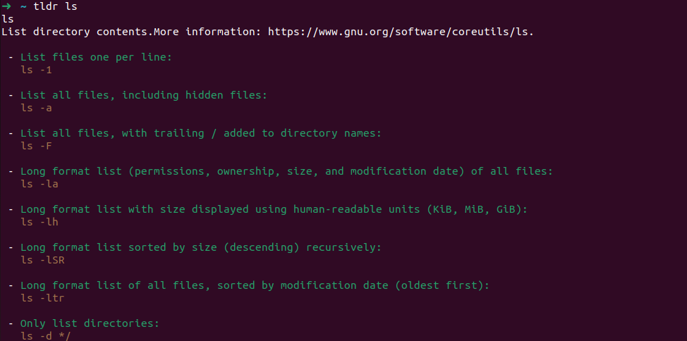
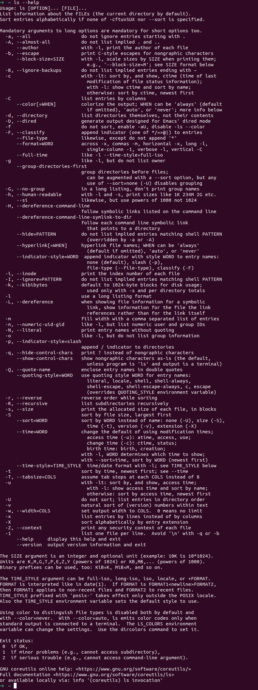

# Lec2 Shell Tools

## Shell 脚本
### `Bash` 中的变量
要定义一个变量非常简单，类似于 `python`中定义变量的方式：

```bash
foo=bar
```

如果你需要访问 `foo`变量中的值，你可以通过 `$foo`的方式来访问它。

例如，打印出 `foo` 变量对应的值：

```bash
echo $foo
# bar
```

值得注意的是，下列代码并不会正常工作，终端会告诉你错误原因：

```bash
foo = bar
# zsh: command not found: foo
```

上面这段代码的实际操作是运行 `foo`程序，并将 `=`与 `bar`作为参数传递给 `foo`程序。

### Bash 中的字符串
类似于 `JavaScript`与 `Python`，Bash 中支持两种方式来定义字符串：单引号`'`与双引号 `"`，不过它们两个的含义并不相同：

+ 单引号`'`：由单引号定义的字符串会被解释为**纯文本内容**
+ 双引号`"`：由双引号定义的字符串更像一个**格式化字符串**。

我们通过一段代码来直观体现两种字符串之间的区别之间的区别：

```bash
foo=bar
echo 'Value is $foo'
# Value is $foo
echo "Value is $foo"
# Value is bar
```

### Bash 中的函数
如同大多数编程语言，`Bash`支持 `if-else``for``while``case`等流程控制语句。`Bash`还支持函数，函数可以接收参数并执行自定义操作，例如下面的例子：

```bash
# mcd.sh
mcd () {
  mkdir -p "$1"
  cd "$1"
}
```

该函数是 `mkdir`与 `cd`命令的顺序结合，作用是以接收到的第 1 个参数为文件夹名创建目录，随后切换到该目录中。

代码中的 `$1`是一个特殊占位符，表示传递过来的第一个参数。

`Bash` 使用了很多特殊的变量来表示参数、错误代码和相关变量。下面列举了其中一些变量，更完整的列表可以参考[Special Characters](https://www.tldp.org/LDP/abs/html/special-chars.html)。

+ `$0` - 脚本名
+ `$1` 到  `$9` - 脚本的参数。`$1`是第一个参数，依此类推。

> 可以认为 `$<number>`占位符等同于 `argv[number]`
>

+ `$@` - 所有参数
+ `$#` - 参数个数
+ `$?` - 前一个命令的返回值
+ `$$` - 当前脚本的进程识别码
+ `!!` - 完整的上一条命令，包括参数。  
    + 常见应用：当你因为权限不足执行命令失败时，可以使用 `sudo !!` 再尝试一次。

+ `$_` - 上一条命令的最后一个参数。如果你正在使用的是交互式 Shell，你可以通过按下 `Esc` 之后键入 . 来获取这个值。

### Bash 中的返回值与逻辑运算符
命令执行完成或者执行出错时，都会向 `STDOUT`返回**输出值**，向 `STDERR`返回**错误码以及错误信息**，便于脚本以更加友好的方式报告错误。

返回码或退出状态是脚本/命令之间交流执行状态的方式。类似于 C 语言中的 `return 0`，返回值 0 表示正常执行，其他所有非 0 的返回值都表示有错误发生。

这些 exitValue 可以被用于逻辑运算中。`Bash`中的逻辑运算符包含逻辑或运算符 `||`与逻辑与运算符 `&&` 两种。退出码可以搭配上面提到的两个操作符使用，用来进行条件判断，决定是否执行其他程序：

```bash
# 逻辑运算符的短路效应
true || echo "This will not be printed"
# 无输出，表明echo命令并没有被执行
false && echo "This will not be printed forever"
# 无输出

true && echo "Things went well"
# 输出 Things went well
false || echo "Oops, fail"
# 输出 Oops, fail

# 当要在同一行执行多个命令时，可以使用分号分隔
false ; echo "This will always run"
# 输出 This will always run
```

### 将命令的输出存储到变量中
对于这个问题，也许你受到上一节内容的启发，会尝试着使用流重定向运算符 `>` 来命令的输出流进行重定向，通过这种方式将输出存储到变量中。

```bash
foo=bar
# 尝试将流重定向至 foo 变量
echo "Hello, $foo" > foo
```

但是当你尝试重新输出 `foo` 变量的值时，发现输出如下：

```bash
echo $foo
# bar
```

上面的解决方法对于这个问题是个经典的反例： 重定向运算符 `>` 实际上将命令的输出重定向到一个**文件**，而无法将输出存储到变量中。

如果你使用 `ls`命令，你可以很明显地发现当前目录下出现了一个 `foo` 文件。

解决这种问题的方法是**使用命令替换(**_command substitution)_，它有两种写法：

1. 采用反引号 ``...`` 
2. (推荐) 使用 `$(...)` 语法

```bash
foo=$(echo "Hello, world")
echo $foo
# Hello, world
```

当使用命令替换的方式来执行命令时，命令的输出结果会替换掉命令替换语法(即 `$(CMD)`)。

比如说执行 `for file in $(ls)` 这条语句时，会先执行 `ls` 命令，然后将执行以后的结果替换掉 `$(ls)`，并遍历得到的这些返回值。

> Extra：
>
> 还有一个与命令替换类似的冷门特性——进程替换(_process substitution)。_
>
> `<( CMD )` 会执行 `CMD` 并将结果输出到一个**临时文件**中，并将 `<( CMD )`**替换成临时文件名**。
>
> 这在我们希望返回值通过文件而不是 `STDIN`传递时很有用。例如， `diff <(ls foo) <(ls bar)` 会显示文件夹 `foo` 和 `bar` 中文件的区别。
>

### 例子-1
上面说了这么多，看个例子吧：

```bash
#!/bin/bash

echo "Starting program at $(date)"

echo "Running program $0 with $# arguments with pid $$"

for file in "$@"; do
    # 我们将标准输出流和标准错误流重定向到Null，因为我们并不关心这些信息
    grep foobar "$file" > /dev/null 2> /dev/null
    # 如果没有找到模板字符串，grep的退出状态码会改变
    if [[ $? -ne 0 ]]; then
        echo "File $file does not have any foobar, adding one"
        echo "# foobar" >> "$file"
    fi
done
```

<details class="lake-collapse"><summary id="uc7ec0351"><span class="ne-text" style="font-size: 19px">代码分析(不要一上来就看啊 kuso!)</span></summary><pre data-language="bash" id="Rd4MF" class="ne-codeblock language-bash"><code>#!/bin/bash

echo &quot;Starting program at $(date)&quot; # date会被替换成日期和时间

echo &quot;Running program $0 with $# arguments with pid $$&quot;

for file in &quot;$@&quot;; do
    # 我们将标准输出流和标准错误流重定向到Null，因为我们并不关心这些信息
    # 写入 /dev/null 中的内容会被删除
    # 此处我们不关心文件内容，只关心查找结果(使用退出状态码来表征)
    grep foobar &quot;$file&quot; &gt; /dev/null 2&gt; /dev/null
    # 如果模式没有找到，则grep退出状态为 1
    if [[ $? -ne 0 ]]; then
        # 如果状态码不等于 0 则执行该分支操作
        # -ne 是 test 中的比较操作符之一，详情可以查看 test 的手册
        echo &quot;File $file does not have any foobar, adding one&quot;
        echo &quot;# foobar&quot; &gt;&gt; &quot;$file&quot;
    fi
done</code></pre></details>
可以，请看下面的内容：

### 常用通配符

下表列出了常用的通配符：

| 字符 | 含义 |
| :---: | :---: |
| * | 匹配0到多个字符 |
| ? | 匹配任意一个字符 |
| [list] | 匹配list中的任意单一字符 |
| [**^**list] | 匹配**除list中任意单一字符外**的任意单一字符 |
| [ch_1-ch_2] | 匹配从ch_1到ch_2范围内的任意单一字符 |
| (str_1, str_2, ...) | 匹配元组内的任意一个字符串 |
| {ch_1..ch_2} | 匹配ch_1到ch_2范围内的**全部**字符 |

简单介绍一下部分符号的用法：

+ 通配符 - 使用 `?` 和 `*` 来匹配一个或多个字符。例如，`rm foo?` 删除 `foo1` 和 `foo2`，而 `rm foo*` 删除除了 `bar` 之外的所有文件。
+ 花括号 `{}` - 用于自动展开带有公共子串的命令，方便进行批量操作。

```bash
mkdir project{1..9}
# 被展开为
mkdir project1 project2 project3 project4 project5 project6 project7 project8 project9

mv *{.py,.sh} folder
# 移动所有 *.py 和 *.sh 文件至 folder 文件夹

touch {foo,bar}/{a..h}
# 创建 foo/a, foo/b, ... foo/h, bar/a, bar/b, ... bar/h
```

## Shell 工具

### tldr - 查看命令如何使用

> 部分术语说明
>
> + 标记 (flag)：一般形式为 `-$lowerCaseLetter`。例如 `mkdir -p`
> + 选项(option)：与标记形式类似，不过后面一般会跟上参数。例如 `openapi -client axios`

有时手册内容过于详实，不易查找常用标记和语法。 [TLDR pages](https://tldr.sh/) 提供简洁案例，帮助快速找到正确选项。



相比之下，`man`命令或 `-h,-help` 标记则显得内容丰富。



### 查找文件

在命令行中，寻找文件是一项常见但并不简单的任务。`find`命令能够递归地搜索符合条件的文件，例如：

```bash
find . -name src -type d
find . -path '*/test/*.py' -type f
find . -mtime -1
find . -size +500k -size -10M -name '*.tar.gz'
```

`find` 还能对找到的文件执行操作：

```bash
find . -name '*.tmp' -exec rm {} \;
find . -name '*.png' -exec convert {} {}.jpg \;
```

使用 `fd` 指令可以更简化查找，例如找 `.py` 文件：

+ `find`： `find -name '*.py'`
+ `fd` ： `fd '*.py'`

对于更高效的查找，可以使用 `locate`，它使用由 `updatedb` 更新的数据库，虽然速度快，但只能通过文件名查找。

### 查找代码/查找文件内容

如果需要获取文件中的信息，使用 `grep` 是个好选择。`grep` 支持多种选项：

+ `-C`：获取上下文（Context）
+ `-v`：反选，输出不匹配的结果

例如，`grep -C 5` 输出匹配结果前后五行，而 `-R` 选项可以递归进入子目录。

### 查找 Shell 命令历史记录

使用 `history` 命令可以访问 shell 中的历史命令。也可以用 `Ctrl+R` 进行命令历史的回溯搜索。

一些插件如 [fzf](https://github.com/junegunn/fzf/wiki/Configuring-shell-key-bindings#ctrl-r) 和 [zsh-autosuggestions](https://github.com/zsh-users/zsh-autosuggestions) 能提升搜索体验。

### 文件夹导航

为了在目录间高效切换，可以设置 alias 或使用 [ln -s](https://man7.org/linux/man-pages/man1/ln.1.html) 创建符号连接等工具，如 [fasd](https://github.com/clvv/fasd) 和 [autojump](https://github.com/wting/autojump)。


> 更新: 2024-09-15 15:38:39  
> 原文: <https://www.yuque.com/yuqueyonghukaqxkk/self_learning_route/bpdxr02nytzd3dgi>