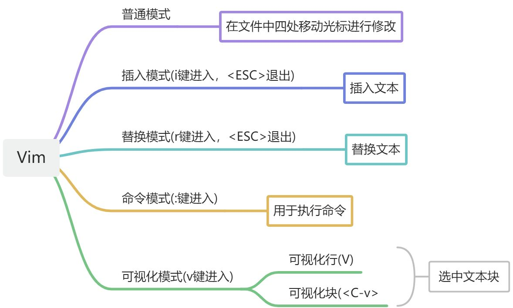
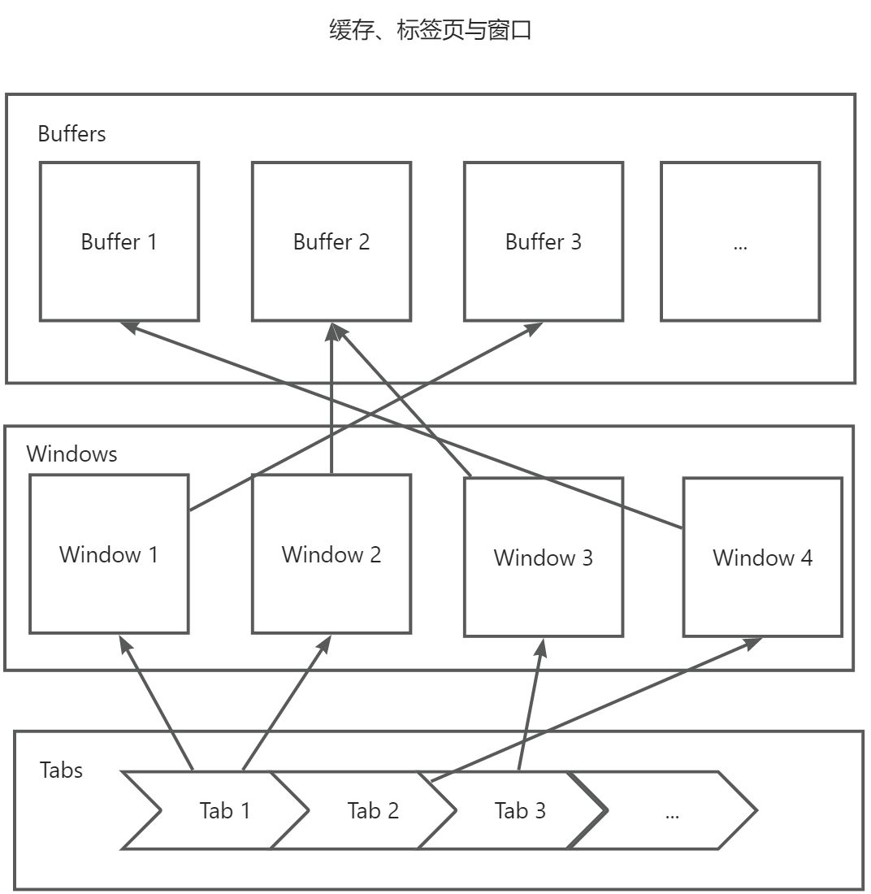
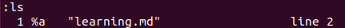
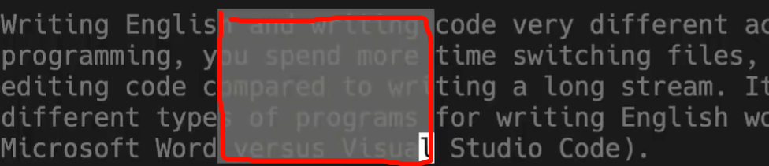

# Lec3 Editor - Vim

## 学习新的高效编辑器的必要性与步骤
<font style="color:rgb(0, 0, 0);">作为程序员，我们大部分时间都花在代码编辑上，所以花点时间掌握某个适合自己的编辑器是非常值得的。通常学习使用一个新的编辑器包含以下步骤：</font>

+ <font style="color:rgb(0, 0, 0);">阅读教程（比如这节课以及我们为您提供的资源）</font>
+ <font style="color:rgb(0, 0, 0);">坚持使用它来完成你所有的编辑工作（即使一开始这会让你的工作效率降低）</font>
+ <font style="color:rgb(0, 0, 0);">随时查阅：如果某个操作看起来像是有更方便的实现方法，</font>**<font style="color:rgb(0, 0, 0);">一般情况下真的会有。</font>**

## <font style="color:rgb(0, 0, 0);">编辑器选择？</font>
<font style="color:rgb(0, 0, 0);">现在最流行的编辑器是什么？</font>[Stack Overflow 的调查](https://insights.stackoverflow.com/survey/2019/#development-environments-and-tools)<font style="color:rgb(0, 0, 0);">显示，</font>[Visual Studio Code](https://code.visualstudio.com/)<font style="color:rgb(0, 0, 0);"> 是目前最流行的代码编辑器。而 </font>[Vim](https://www.vim.org/)<font style="color:rgb(0, 0, 0);"> 则是最流行的基于命令行的编辑器。</font>

<font style="color:rgb(0, 0, 0);">你可以紧跟潮流选择编辑器，也可以自行探索其余高效的编辑器，例如 </font>`<font style="color:rgb(0, 0, 0);">emac</font>`<font style="color:rgb(0, 0, 0);">。</font>

## <font style="color:rgb(0, 0, 0);">Vim 的设计哲学</font>
> 哲学(<font style="color:rgb(68, 68, 68);">Philosophy)，一般可以用中文“思想”“智慧”等词代替，国外用这个词比较多，用于形容优秀的设计等。</font>
>

<font style="color:rgb(0, 0, 0);">在编程的时候，你会把大量时间花在阅读/编辑而不是在写代码上。所以，Vim 是一个 </font>_<font style="color:rgb(0, 0, 0);">多模态</font>_<font style="color:rgb(0, 0, 0);">(Multiple Modal) 编辑器：它对于插入文字和操纵文字有不同的模式。</font>

<font style="color:rgb(0, 0, 0);">Vim 是可编程的（可以使用 Vimscript 或者像 Python 一样的其他程序语言），Vim 的接口本身也是一个程序语言：键入操作（以及其助记名） 是命令，这些命令也是可组合的。Vim </font>**<font style="color:rgb(0, 0, 0);">避免了使用鼠标，因为那样太慢了</font>**<font style="color:rgb(0, 0, 0);">；Vim </font>**<font style="color:rgb(0, 0, 0);">甚至避免用上下左右键</font>**<font style="color:rgb(0, 0, 0);">，因为那样需要太多的手指移动。</font>

<font style="color:rgb(0, 0, 0);">这样的设计哲学使得 Vim 成为了一个能跟上你思维速度的编辑器。</font>

## <font style="color:rgb(0, 0, 0);">Vim 的编辑模式</font>
<font style="color:rgb(0, 0, 0);">Vim 的设计以大多数时间都花在阅读、浏览和进行少量编辑改动为基础，因此它具有多种操作模式：</font>



<font style="color:rgb(0, 0, 0);">在默认设置下，Vim 会在左下角显示当前的模式。</font>

<font style="color:rgb(0, 0, 0);">因为在使用 Vim 时会大量使用 </font>`<font style="color:rgb(0, 0, 0);"><ESC></font>`<font style="color:rgb(0, 0, 0);"> 键，所以可以考虑把大小写锁定键(</font>`<font style="color:rgb(0, 0, 0);"><Caps Lock></font>`<font style="color:rgb(0, 0, 0);">) 重定义成 </font>`<font style="color:rgb(0, 0, 0);"><ESC></font>`<font style="color:rgb(0, 0, 0);"> 键。</font>

## <font style="color:rgb(0, 0, 0);">Vim 的基本操作与基本概念</font>
> **说明：想要真正掌握这些操作需要勤加练习，单纯的记录而不去实践的话，你永远不可能掌握这些操作！**
>

### 缓存、标签页与窗口
运行 Vim 时，它会维护一系列打开的文件，它们被称为缓存(Buffer)。一个 Vim 会话中包含一系列标签页(Tab)，每个标签页中含有若干个窗口(Window)，每个窗口中显示一个缓存。但是，缓存与窗口**并不是一一对应**的关系：一个窗口中只能显示一个缓存，但是一个缓存可以供多个窗口显示。它们之间的具体关系可以用下面这张图来简单描述：



<font style="color:rgb(0, 0, 0);">Vim 启动时会默认打开一个标签页，这个标签也包含一个窗口。当所有的标签页与窗口被关闭时，Vim 进程也就自然退出了。</font>

<font style="color:rgb(0, 0, 0);">如果想要执行退出等相关操作，这种时候就需要进入</font>**<font style="color:rgb(0, 0, 0);">命令行模式</font>**<font style="color:rgb(0, 0, 0);">来执行操作了。</font>

### <font style="color:rgb(0, 0, 0);">命令行模式</font>
<font style="color:rgb(0, 0, 0);">在正常模式下键入 </font>`<font style="color:rgb(0, 0, 0);">:</font>`<font style="color:rgb(0, 0, 0);"> 进入命令行模式。 在键入 </font>`<font style="color:rgb(0, 0, 0);">:</font>`<font style="color:rgb(0, 0, 0);"> 后，你的光标会立即跳到屏幕下方的命令行处。 这个模式下有很多功能，包括打开、保存、关闭文件，以及</font>退出 Vim<font style="color:rgb(0, 0, 0);">。</font>

+ 退出**当前**窗口：`:q`
+ 退出所有窗口：`:qa`(quit all)
+ 保存当前写缓冲流的数据至文件中：`:w`
+ 保存并退出当前窗口：`:wq`(可以看成组合键)
+ 打开文件：`:e <FILE_NAME>`
+ 显示打开的缓存：`:ls`



+ 显示命令或按键的帮助文档：`:help <command/keyName>`
    - `<font style="color:rgb(0, 0, 0);">:help :w</font>`<font style="color:rgb(0, 0, 0);"> </font><font style="color:rgb(0, 0, 0);">打开</font><font style="color:rgb(0, 0, 0);"> </font>`<font style="color:rgb(0, 0, 0);">:w</font>`<font style="color:rgb(0, 0, 0);"> </font><font style="color:rgb(0, 0, 0);">命令的帮助文档</font>
    - `<font style="color:rgb(0, 0, 0);">:help w</font>`<font style="color:rgb(0, 0, 0);"> 打开 </font>`<font style="color:rgb(0, 0, 0);">w</font>`<font style="color:rgb(0, 0, 0);"> 移动的帮助文档</font>

### Vim 的接口其实是一种编程语言
> 本部分引用自笔记中的观点
>

<font style="color:rgb(0, 0, 0);">Vim 最重要的设计思想是 Vim 的界面</font>**<font style="color:rgb(0, 0, 0);">本身是一个程序语言</font>**<font style="color:rgb(0, 0, 0);">。键入操作（以及他们的助记名） 本身是命令，这些命令可以</font>**<font style="color:rgb(0, 0, 0);">组合使用</font>**<font style="color:rgb(0, 0, 0);">。这使得移动和编辑更加高效，特别是在形成肌肉记忆之后。</font>

### <font style="color:rgb(0, 0, 0);">Vim 中的移动操作</font>
> 注意：这些移动操作一般是基于**普通模式**下的光标移动
>

在普通的文本编辑器中，如果需要移动光标，通常会使用四个方向键。

而在 Vim 中，光标的基本移动操作由 `hjkl`四个键位取代(分别为**左下上右**，可以联想着四个方向键的相对排布来记忆)。

除了基本移动操作之外，Vim 还提供了一些更加高效的光标移动操作：

+ <font style="color:rgb(0, 0, 0);">词间跳转： </font>`<font style="color:rgb(0, 0, 0);">w</font>`<font style="color:rgb(0, 0, 0);"> （下一个词）， </font>`<font style="color:rgb(0, 0, 0);">b</font>`<font style="color:rgb(0, 0, 0);"> （词初）， </font>`<font style="color:rgb(0, 0, 0);">e</font>`<font style="color:rgb(0, 0, 0);"> （词尾）</font>
+ <font style="color:rgb(0, 0, 0);">行内跳转： </font>`<font style="color:rgb(0, 0, 0);">0</font>`<font style="color:rgb(0, 0, 0);"> （行初）， </font>`<font style="color:rgb(0, 0, 0);">^</font>`<font style="color:rgb(0, 0, 0);"> （第一个非空格字符）， </font>`<font style="color:rgb(0, 0, 0);">$</font>`<font style="color:rgb(0, 0, 0);"> （行尾）</font>
+ <font style="color:rgb(0, 0, 0);">屏幕内跳转： </font>`<font style="color:rgb(0, 0, 0);">H</font>`<font style="color:rgb(0, 0, 0);"> （屏幕首行）， </font>`<font style="color:rgb(0, 0, 0);">M</font>`<font style="color:rgb(0, 0, 0);"> （屏幕中间）， </font>`<font style="color:rgb(0, 0, 0);">L</font>`<font style="color:rgb(0, 0, 0);"> （屏幕底部）</font>

> 注：这里的屏幕指的是**光标当前所在窗口所占的屏幕**。
>

+ <font style="color:rgb(0, 0, 0);">翻页：</font><font style="color:rgb(0, 0, 0);"> </font>`<font style="color:rgb(0, 0, 0);">Ctrl-u</font>`<font style="color:rgb(0, 0, 0);"> </font><font style="color:rgb(0, 0, 0);">（上翻），</font><font style="color:rgb(0, 0, 0);"> </font>`<font style="color:rgb(0, 0, 0);">Ctrl-d</font>`<font style="color:rgb(0, 0, 0);"> </font><font style="color:rgb(0, 0, 0);">（下翻）</font>
+ <font style="color:rgb(0, 0, 0);">文件内跳转： </font>`<font style="color:rgb(0, 0, 0);">gg</font>`<font style="color:rgb(0, 0, 0);"> （文件头）， </font>`<font style="color:rgb(0, 0, 0);">G</font>`<font style="color:rgb(0, 0, 0);"> （文件尾）</font>
+ <font style="color:rgb(0, 0, 0);">跳转到指定行： </font>`<font style="color:rgb(0, 0, 0);">:{行数}<Enter></font>`<font style="color:rgb(0, 0, 0);"> 或者 </font>`<font style="color:rgb(0, 0, 0);">{行数}G</font>`<font style="color:rgb(0, 0, 0);"> </font>**<font style="color:rgb(0, 0, 0);"></font>**
+ <font style="color:rgb(0, 0, 0);">杂项：</font><font style="color:rgb(0, 0, 0);"> </font>`<font style="color:rgb(0, 0, 0);">%</font>`<font style="color:rgb(0, 0, 0);"> </font><font style="color:rgb(0, 0, 0);">（找到配对，比如括号或者 /* */ 之类的注释对）</font>
+ <font style="color:rgb(0, 0, 0);">查找：</font><font style="color:rgb(0, 0, 0);"> </font>`<font style="color:rgb(0, 0, 0);">f{字符}</font>`<font style="color:rgb(0, 0, 0);">，</font><font style="color:rgb(0, 0, 0);"> </font>`<font style="color:rgb(0, 0, 0);">t{字符}</font>`<font style="color:rgb(0, 0, 0);">，</font><font style="color:rgb(0, 0, 0);"> </font>`<font style="color:rgb(0, 0, 0);">F{字符}</font>`<font style="color:rgb(0, 0, 0);">，</font><font style="color:rgb(0, 0, 0);"> </font>`<font style="color:rgb(0, 0, 0);">T{字符}</font>`
    - <font style="color:rgb(0, 0, 0);">查找/到 向前/向后 在本行的{字符}</font>
    - `<font style="color:rgb(0, 0, 0);">,</font>`<font style="color:rgb(0, 0, 0);"> </font><font style="color:rgb(0, 0, 0);">/</font><font style="color:rgb(0, 0, 0);"> </font>`<font style="color:rgb(0, 0, 0);">;</font>`<font style="color:rgb(0, 0, 0);"> </font><font style="color:rgb(0, 0, 0);">用于导航匹配</font>
+ <font style="color:rgb(0, 0, 0);">搜索: </font>`<font style="color:rgb(0, 0, 0);">/{正则表达式}</font>`<font style="color:rgb(0, 0, 0);">, </font>`<font style="color:rgb(0, 0, 0);">n</font>`<font style="color:rgb(0, 0, 0);"> / </font>`<font style="color:rgb(0, 0, 0);">N</font>`<font style="color:rgb(0, 0, 0);"> 用于导航匹配</font>

### Vim 中的编辑操作
<font style="color:rgb(0, 0, 0);">所有需要用鼠标做的事， 现在都可以用键盘——采用编辑命令和移动命令的组合——来完成。 这就是 Vim 的界面开始看起来像一个编程语言的时候。</font>

+ `<font style="color:rgb(0, 0, 0);">i</font>`<font style="color:rgb(0, 0, 0);"> 进入插入模式，</font>`<font style="color:rgb(0, 0, 0);">a</font>`<font style="color:rgb(0, 0, 0);"> 也能进入插入模式，单纯起始位置不相同(before/after 的区别)。</font>
    - <font style="color:rgb(0, 0, 0);">但是对于操纵/编辑文本，不单可用退格键完成</font>
+ `<font style="color:rgb(0, 0, 0);">O</font>`<font style="color:rgb(0, 0, 0);"> / </font>`<font style="color:rgb(0, 0, 0);">o</font>`<font style="color:rgb(0, 0, 0);"> 在当前光标所在行之上/之下插入行，</font>**<font style="color:rgb(0, 0, 0);">并进入编辑模式</font>**
+ `<font style="color:rgb(0, 0, 0);">d{移动命令}</font>`<font style="color:rgb(0, 0, 0);"> 删除 </font>`<font style="color:rgb(0, 0, 0);">{移动命令}</font>`<font style="color:rgb(0, 0, 0);"> 对应的结果</font>
    - <font style="color:rgb(0, 0, 0);">例如，</font>`<font style="color:rgb(0, 0, 0);">dw</font>`<font style="color:rgb(0, 0, 0);"> </font><font style="color:rgb(0, 0, 0);">删除词,</font><font style="color:rgb(0, 0, 0);"> </font>`<font style="color:rgb(0, 0, 0);">d$</font>`<font style="color:rgb(0, 0, 0);"> </font><font style="color:rgb(0, 0, 0);">删除到行尾,</font><font style="color:rgb(0, 0, 0);"> </font>`<font style="color:rgb(0, 0, 0);">d0</font>`<font style="color:rgb(0, 0, 0);"> </font><font style="color:rgb(0, 0, 0);">删除到行头。</font>
+ `<font style="color:rgb(0, 0, 0);">c{移动命令}</font>`<font style="color:rgb(0, 0, 0);"> 在</font>`<font style="color:rgb(0, 0, 0);">d{移动命令}</font>`<font style="color:rgb(0, 0, 0);"> 的基础上，</font>**<font style="color:rgb(0, 0, 0);">进入编辑模式</font>**
    - <font style="color:rgb(0, 0, 0);">例如，</font>`<font style="color:rgb(0, 0, 0);">cw</font>`<font style="color:rgb(0, 0, 0);"> 在删除光标所在词之后，进入编辑模式</font>
+ `<font style="color:rgb(0, 0, 0);">x</font>`<font style="color:rgb(0, 0, 0);"> 删除字符（等同于 </font>`<font style="color:rgb(0, 0, 0);">dl</font>`<font style="color:rgb(0, 0, 0);">组合键）</font>
+ `<font style="color:rgb(0, 0, 0);">s</font>`<font style="color:rgb(0, 0, 0);"> 替换字符（等同于 </font>`<font style="color:rgb(0, 0, 0);">xi</font>`<font style="color:rgb(0, 0, 0);">组合键）</font>
+ <font style="color:rgb(0, 0, 0);">可视化模式 + 操作</font>
    - **<font style="color:rgb(0, 0, 0);">移动</font>**<font style="color:rgb(0, 0, 0);">光标以选中文字, </font>`<font style="color:rgb(0, 0, 0);">d</font>`<font style="color:rgb(0, 0, 0);"> 删除 或者 </font>`<font style="color:rgb(0, 0, 0);">c</font>`<font style="color:rgb(0, 0, 0);"> 改变</font>
+ `<font style="color:rgb(0, 0, 0);">u</font>`<font style="color:rgb(0, 0, 0);"> 撤销, </font>`<font style="color:rgb(0, 0, 0);"><C-r> = Ctrl + r</font>`<font style="color:rgb(0, 0, 0);"> 重做</font>
+ `<font style="color:rgb(0, 0, 0);">y</font>`<font style="color:rgb(0, 0, 0);"> 复制 / “yank” </font>**<font style="color:rgb(0, 0, 0);">（其他一些命令比如 </font>**`**<font style="color:rgb(0, 0, 0);">d</font>**`**<font style="color:rgb(0, 0, 0);"> 也会复制）-> 命令复制没试过</font>**
    - `<font style="color:rgb(0, 0, 0);">yy</font>`<font style="color:rgb(0, 0, 0);"> 复制光标当前所在行内容</font>
+ `<font style="color:rgb(0, 0, 0);">p</font>`<font style="color:rgb(0, 0, 0);"> 粘贴</font>
+ `<font style="color:rgb(0, 0, 0);">~</font>`<font style="color:rgb(0, 0, 0);"> 改变选中区域字符的大小写</font>

### Vim 中的选择操作
这里所说的选择操作与 Vim 中的可视化功能的作用大体相同。

要想进行选择操作，首先需要进入**可视化模式。**

<font style="color:rgb(0, 0, 0);">可视化模式:</font>

+ <font style="color:rgb(0, 0, 0);">可视化：</font>`<font style="color:rgb(0, 0, 0);">v</font>`
    - <font style="color:rgb(0, 0, 0);">非常朴素的选择</font>
+ <font style="color:rgb(0, 0, 0);">可视化行：</font><font style="color:rgb(0, 0, 0);"> </font>`<font style="color:rgb(0, 0, 0);">V</font>`
    - <font style="color:rgb(0, 0, 0);">单次选择的范围单位为</font>**<font style="color:rgb(0, 0, 0);">行</font>**<font style="color:rgb(0, 0, 0);">。</font>
+ <font style="color:rgb(0, 0, 0);">可视化块：</font>`<font style="color:rgb(0, 0, 0);"><C-v></font>`
    - <font style="color:rgb(0, 0, 0);">单次选择的范围单位为</font>**<font style="color:rgb(0, 0, 0);">矩形块</font>**<font style="color:rgb(0, 0, 0);">。可以看下面的例子：</font>



<font style="color:rgb(0, 0, 0);">可视化模式可以</font>**<font style="color:rgb(0, 0, 0);">结合移动命令来进行自定义选中</font>**<font style="color:rgb(0, 0, 0);">。</font>

### <font style="color:rgb(0, 0, 0);">Vim 中的“计数”</font>
> 概念补充
>
> 1. <font style="color:rgb(0, 0, 0);">在 Vim 里面移动也被称为 “名词”， 因为它们指向文字块。</font>
> 2. <font style="color:rgb(0, 0, 0);">Vim 的编辑命令也被称为 “动词”， 因为动词可以施动于名词。</font>
>

<font style="color:rgb(0, 0, 0);">你可以用一个</font>**<font style="color:rgb(0, 0, 0);">计数</font>**<font style="color:rgb(0, 0, 0);">(</font>**<font style="color:rgb(0, 0, 0);">count</font>**<font style="color:rgb(0, 0, 0);">，为了便于理解，可以称作 </font>**<font style="color:rgb(0, 0, 0);">count prefix</font>**<font style="color:rgb(0, 0, 0);"> ) 来结合“名词”和“动词”，这会执行指定操作若干次，例如：</font>

+ `<font style="color:rgb(0, 0, 0);">3w</font>`<font style="color:rgb(0, 0, 0);"> </font><font style="color:rgb(0, 0, 0);">向后移动三个词</font>
+ `<font style="color:rgb(0, 0, 0);">5j</font>`<font style="color:rgb(0, 0, 0);"> </font><font style="color:rgb(0, 0, 0);">向下移动 5 行</font>
+ `<font style="color:rgb(0, 0, 0);">7dw</font>`<font style="color:rgb(0, 0, 0);"> 删除 7 个词</font>
+ `**<font style="color:rgb(0, 0, 0);">c2w = 2cw</font>**`<font style="color:rgb(0, 0, 0);"> 删除两个词，并进入编辑模式</font>**<font style="color:rgb(0, 0, 0);"></font>**

<font style="color:rgb(0, 0, 0);">如果想要在 Vim 中查看相关帮助，可以使用 </font>`<font style="color:rgb(0, 0, 0);">:help count</font>`<font style="color:rgb(0, 0, 0);"> 来查看帮助文档。</font>

> 你可能注意到了 `c2w = 2cw` 这个例子，其实从 `4j` 这种简单的复数移动操作能够正常生效这一事实出发，你应该能想到为什么这两个命令是等效的。
>

<details class="lake-collapse"><summary id="uf190e3bb"><span class="ne-text" style="font-size: 19px">ChatGPT 的详细回答 (</span><strong><span class="ne-text" style="font-size: 19px">英文版</span></strong><span class="ne-text" style="font-size: 19px">，实在看不懂用翻译功能就行)</span></summary><p id="ue6a9f281" class="ne-p"><span class="ne-text">In Vim, commands like </span><code class="ne-code"><span class="ne-text">c2w</span></code><span class="ne-text"> and </span><code class="ne-code"><span class="ne-text">2cw</span></code><span class="ne-text"> follow the same logic, and both are valid. Here’s how they work:</span></p><ul class="ne-ul"><li id="u0d7378ea" data-lake-index-type="0"><code class="ne-code"><span class="ne-text">c2w</span></code><span class="ne-text">: This means &quot;change two words.&quot; The command </span><code class="ne-code"><span class="ne-text">c</span></code><span class="ne-text"> is for change, and </span><code class="ne-code"><span class="ne-text">2w</span></code><span class="ne-text"> means to move forward by two words. So the entire sequence performs a change that spans two words.</span></li><li id="uc12af811" data-lake-index-type="0"><code class="ne-code"><span class="ne-text">2cw</span></code><span class="ne-text">: In this case, the number </span><code class="ne-code"><span class="ne-text">2</span></code><span class="ne-text"> applies to the movement command </span><code class="ne-code"><span class="ne-text">w</span></code><span class="ne-text">, meaning &quot;move forward by two words,&quot; and then </span><code class="ne-code"><span class="ne-text">c</span></code><span class="ne-text"> (change) operates on that motion.</span></li></ul><p id="u95b1aa5e" class="ne-p"><span class="ne-text">Essentially, both mean the same thing because Vim allows flexibility in how you input the count:</span></p><ul class="ne-ul"><li id="u1d6252e3" data-lake-index-type="0"><span class="ne-text">You can place the count before the command (</span><code class="ne-code"><span class="ne-text">2cw</span></code><span class="ne-text">), which modifies the motion command.</span></li><li id="u833ee21a" data-lake-index-type="0"><span class="ne-text">You can also place the count between the command and the motion (</span><code class="ne-code"><span class="ne-text">c2w</span></code><span class="ne-text">), which makes the command work on a longer motion range.</span></li></ul><p id="u7c56c541" class="ne-p"><span class="ne-text">Other similar examples:</span></p><ul class="ne-ul"><li id="u9bd9683d" data-lake-index-type="0"><code class="ne-code"><span class="ne-text">d3w</span></code><span class="ne-text"> and </span><code class="ne-code"><span class="ne-text">d2e</span></code><span class="ne-text">: These delete multiple words (</span><code class="ne-code"><span class="ne-text">3w</span></code><span class="ne-text"> deletes three words, </span><code class="ne-code"><span class="ne-text">2e</span></code><span class="ne-text"> deletes until the end of the second word).</span></li><li id="u426421d3" data-lake-index-type="0"><code class="ne-code"><span class="ne-text">y4j</span></code><span class="ne-text"> and </span><code class="ne-code"><span class="ne-text">y5k</span></code><span class="ne-text">: These yank (copy) four lines down or five lines up.</span></li><li id="ue2e9a431" data-lake-index-type="0"><code class="ne-code"><span class="ne-text">&gt;2j</span></code><span class="ne-text"> or </span><code class="ne-code"><span class="ne-text">2&gt;j</span></code><span class="ne-text">: Both increase the indentation of two lines downward.</span></li></ul><p id="u4d87be68" class="ne-p"><span class="ne-text">Vim is designed to be versatile with counts and commands, so it accepts both forms.</span></p></details>
### Vim 中的修饰语
<font style="color:rgb(0, 0, 0);">可以用修饰语改变“名词”的意义。修饰语主要有以下两种：</font>

+ `<font style="color:rgb(0, 0, 0);">i</font>`<font style="color:rgb(0, 0, 0);">，表示“内部”或者“在内”</font>
+ `<font style="color:rgb(0, 0, 0);">a</font>`<font style="color:rgb(0, 0, 0);">， 表示“周围”。</font>

<font style="color:rgb(0, 0, 0);">下面是一些修饰语的使用例子：</font>

+ `<font style="color:rgb(0, 0, 0);">ci(</font>`<font style="color:rgb(0, 0, 0);"> 改变当前/距离最近的括号</font>**<font style="color:rgb(0, 0, 0);">内</font>**<font style="color:rgb(0, 0, 0);">的内容(inside)</font>
+ `<font style="color:rgb(0, 0, 0);">ci[</font>`<font style="color:rgb(0, 0, 0);"> 改变当前/距离最近的方括号</font>**<font style="color:rgb(0, 0, 0);">内</font>**<font style="color:rgb(0, 0, 0);">的内容</font>
+ `<font style="color:rgb(0, 0, 0);">da'</font>`<font style="color:rgb(0, 0, 0);"> 删除一个单引号字符串， </font>**<font style="color:rgb(0, 0, 0);">包括周围的单引号(around)</font>**

### <font style="color:rgb(0, 0, 0);">案例</font>
下面是一个有问题的 FizzBuzz 实现：

<details class="lake-collapse"><summary id="uf0b44964"><span class="ne-text" style="font-size: 19px">Fizz buzz 游戏的详细说明</span></summary><p id="u2e691a38" class="ne-p"><span class="ne-text" style="font-size: 19px"></span><strong><span class="ne-text" style="color: rgb(32, 33, 34); font-size: 19px">Fizz buzz</span></strong><span class="ne-text" style="color: rgb(32, 33, 34); font-size: 19px"> is a group word game for children to teach them about </span><span class="ne-text" style="color: rgb(32, 33, 34); font-size: 19px">. Players take turns to count incrementally, replacing any number </span><strong><span class="ne-text" style="color: rgb(32, 33, 34); font-size: 19px">divisible by three</span></strong><span class="ne-text" style="color: rgb(32, 33, 34); font-size: 19px"> with the word &quot;</span><strong><span class="ne-text" style="color: rgb(32, 33, 34); font-size: 19px">fizz</span></strong><span class="ne-text" style="color: rgb(32, 33, 34); font-size: 19px">&quot;, and any number </span><strong><span class="ne-text" style="color: rgb(32, 33, 34); font-size: 19px">divisible by five</span></strong><span class="ne-text" style="color: rgb(32, 33, 34); font-size: 19px"> with the word &quot;</span><strong><span class="ne-text" style="color: rgb(32, 33, 34); font-size: 19px">buzz</span></strong><span class="ne-text" style="color: rgb(32, 33, 34); font-size: 19px">&quot;, and </span><strong><span class="ne-text" style="color: rgb(32, 33, 34); font-size: 19px">any number divisible by both three and five</span></strong><span class="ne-text" style="color: rgb(32, 33, 34); font-size: 19px"> with the word &quot;</span><strong><span class="ne-text" style="color: rgb(32, 33, 34); font-size: 19px">fizzbuzz</span></strong><span class="ne-text" style="color: rgb(32, 33, 34); font-size: 19px">&quot;.</span></p></details>
```python
def fizz_buzz(limit):
    for i in range(limit):
        if i % 3 == 0:
            print('fizz')
        if i % 5 == 0:
            print('fizz')
        if i % 3 and i % 5:
            print(i)

def main():
    fizz_buzz(10)
```

主要的问题点在于：

1. 主函数 `main` 未被调用
2. `for` 循环从 0 开始 -> 期望：从 1 开始
3. 当 `i` 为 15 的整数倍时，会在不同行输出信息 -> 期望：这种情况下信息显示在同行
4. 当 `i` 为 5 的整数倍时，输出 fizz -> 期望：输出 buzz
5. <font style="color:rgb(0, 0, 0);">采用硬编码的参数 10 -> 期望：采用从命令行接收到的参数</font>

<font style="color:rgb(0, 0, 0);">这里我并没有给出实现步骤，你可以自己尝试一下(正好有一道课后练习题，详见 </font>[Lec3 Exercise](https://www.yuque.com/yuqueyonghukaqxkk/self_learning_route/ib7pyoamikh1k867) <font style="color:rgb(0, 0, 0);">)，并且思考如何让各步骤的操作数</font>**<font style="color:rgb(0, 0, 0);">尽可能少</font>**<font style="color:rgb(0, 0, 0);">。</font>

## <font style="color:rgb(0, 0, 0);">Vim 的配置</font>
<font style="color:rgb(0, 0, 0);">Vim 作为程序员使用的文本编辑器之一，它自然支持高度自定义化配置。</font>

<font style="color:rgb(0, 0, 0);">Vim 的配置项可通过编辑位于</font>`<font style="color:rgb(0, 0, 0);">~/.vimrc</font>`<font style="color:rgb(0, 0, 0);"> 的文本配置文件来进行配置。你可以下载别人的 </font>`<font style="color:rgb(0, 0, 0);">.vimrc</font>`<font style="color:rgb(0, 0, 0);"> 文件作为你自己的配置文件，也可以参考文档来自定义配置相关选项。</font>

<font style="color:rgb(0, 0, 0);">这门课的授课者们提供了一个文档详细的基本设置，你可以用它当作你的初始设置。推荐使用这个设置</font>~~<font style="color:rgb(0, 0, 0);">(至少我们认为你不应该使用原始人 Vim)</font>~~<font style="color:rgb(0, 0, 0);">，因为它修复了一些 Vim 默认设置奇怪行为。 在</font>[这里](https://missing-semester-cn.github.io/2020/files/vimrc)<font style="color:rgb(0, 0, 0);">下载授课者提供的配置文件，然后将它保存成 </font>`<font style="color:rgb(0, 0, 0);">~/.vimrc</font>`<font style="color:rgb(0, 0, 0);">.</font>

<font style="color:rgb(0, 0, 0);">当然了，参考下面这些资源进行配置也是完全可以的：</font>

+ [Configuring vim · GitBook (nju-projectn.github.io)](https://nju-projectn.github.io/ics-pa-gitbook/ics2024/0.4.html)
+ 待补充

---

> PS：之后的部分基本就是从官方笔记上复制下来的了，这只是为了不让我频繁地去查阅那个页面上的内容()
>

---

## <font style="color:rgb(0, 0, 0);">扩展 Vim</font>
<font style="color:rgb(0, 0, 0);">Vim 有很多扩展插件。跟很多互联网上已经过时的建议相反，你</font><font style="color:rgb(0, 0, 0);"> </font>_<font style="color:rgb(0, 0, 0);">不</font>_<font style="color:rgb(0, 0, 0);"> </font><font style="color:rgb(0, 0, 0);">需要在 Vim 使用一个插件 管理器（从 Vim 8.0 开始）。你可以使用内置的插件管理系统。只需要创建一个</font><font style="color:rgb(0, 0, 0);"> </font>`<font style="color:rgb(0, 0, 0);">~/.vim/pack/vendor/start/</font>`<font style="color:rgb(0, 0, 0);"> </font><font style="color:rgb(0, 0, 0);">的文件夹，然后把插件放到这里（比如通过</font><font style="color:rgb(0, 0, 0);"> </font>`<font style="color:rgb(0, 0, 0);">git clone</font>`<font style="color:rgb(0, 0, 0);">）。</font>

<font style="color:rgb(0, 0, 0);">以下是一些我们最爱的插件：</font>

+ [<font style="color:rgb(0, 0, 0);">ctrlp.vim</font>](https://github.com/ctrlpvim/ctrlp.vim)<font style="color:rgb(0, 0, 0);">: 模糊文件查找</font>
+ [<font style="color:rgb(0, 0, 0);">ack.vim</font>](https://github.com/mileszs/ack.vim)<font style="color:rgb(0, 0, 0);">: 代码搜索</font>
+ [<font style="color:rgb(0, 0, 0);">nerdtree</font>](https://github.com/scrooloose/nerdtree)<font style="color:rgb(0, 0, 0);">: 文件浏览器</font>
+ [<font style="color:rgb(0, 0, 0);">vim-easymotion</font>](https://github.com/easymotion/vim-easymotion)<font style="color:rgb(0, 0, 0);">: 魔术操作</font>

<font style="color:rgb(0, 0, 0);">我们尽量避免在这里提供一份冗长的插件列表。你可以查看讲师们的开源的配置文件 (</font>[<font style="color:rgb(0, 0, 0);">Anish</font>](https://github.com/anishathalye/dotfiles)<font style="color:rgb(0, 0, 0);">,</font><font style="color:rgb(0, 0, 0);"> </font>[<font style="color:rgb(0, 0, 0);">Jon</font>](https://github.com/jonhoo/configs)<font style="color:rgb(0, 0, 0);"> </font><font style="color:rgb(0, 0, 0);">(使用了</font><font style="color:rgb(0, 0, 0);"> </font>[<font style="color:rgb(0, 0, 0);">neovim</font>](https://github.com/JJGO/dotfiles/blob/master/vim/.vimrc)<font style="color:rgb(0, 0, 0);">),</font><font style="color:rgb(0, 0, 0);"> </font>[<font style="color:rgb(0, 0, 0);">Jose</font>](https://github.com/JJGO/dotfiles)<font style="color:rgb(0, 0, 0);">) 来看看我们使用的其他插件。 浏览</font><font style="color:rgb(0, 0, 0);"> </font>[<font style="color:rgb(0, 0, 0);">Vim Awesome</font>](https://vimawesome.com/)<font style="color:rgb(0, 0, 0);"> </font><font style="color:rgb(0, 0, 0);">来了解一些很棒的插件。 这个话题也有很多博客文章：搜索 “best Vim plugins”。</font>

## <font style="color:rgb(0, 0, 0);">其他程序的 Vim 模式</font>
<font style="color:rgb(0, 0, 0);">很多工具提供了 Vim 模式。这些 Vim 模式的质量参差不齐；取决于具体工具，有的提供了 很多酷炫的 Vim 功能，但是大多数对基本功能支持的很好。</font>

### <font style="color:rgb(0, 0, 0);">Shell</font>
+ <font style="color:rgb(0, 0, 0);">如果你是一个 Bash 用户，用 </font>`<font style="color:rgb(0, 0, 0);">set -o vi</font>`<font style="color:rgb(0, 0, 0);">。</font>
+ <font style="color:rgb(0, 0, 0);">如果你用 Zsh：</font>`<font style="color:rgb(0, 0, 0);">bindkey -v</font>`<font style="color:rgb(0, 0, 0);">。</font>
+ <font style="color:rgb(0, 0, 0);">如果你用 Fish： </font>`<font style="color:rgb(0, 0, 0);">fish_vi_key_bindings</font>`<font style="color:rgb(0, 0, 0);">。</font>

<font style="color:rgb(0, 0, 0);">另外，不管利用什么 shell，你可以 </font>`<font style="color:rgb(0, 0, 0);">export EDITOR=vim</font>`<font style="color:rgb(0, 0, 0);">。 这是一个用来决定当一个程序需要启动编辑时启动哪个的环境变量。 例如，</font>`<font style="color:rgb(0, 0, 0);">git</font>`<font style="color:rgb(0, 0, 0);"> 会使用这个编辑器来编辑 commit 信息。</font>

### <font style="color:rgb(0, 0, 0);">Readline</font>
<font style="color:rgb(0, 0, 0);">很多程序使用</font><font style="color:rgb(0, 0, 0);"> </font>[<font style="color:rgb(0, 0, 0);">GNU Readline</font>](https://tiswww.case.edu/php/chet/readline/rltop.html)<font style="color:rgb(0, 0, 0);"> </font><font style="color:rgb(0, 0, 0);">库来作为 它们的命令控制行界面。Readline 也支持基本的 Vim 模式， 可以通过在</font><font style="color:rgb(0, 0, 0);"> </font>`<font style="color:rgb(0, 0, 0);">~/.inputrc</font>`<font style="color:rgb(0, 0, 0);"> </font><font style="color:rgb(0, 0, 0);">添加如下行开启：</font>

```plain
set editing-mode vi
```

<font style="color:rgb(0, 0, 0);">比如，在这个设置下，Python REPL 会支持 Vim 快捷键。</font>

### <font style="color:rgb(0, 0, 0);">其他</font>
<font style="color:rgb(0, 0, 0);">甚至有 Vim 的网页浏览快捷键</font><font style="color:rgb(0, 0, 0);"> </font>[<font style="color:rgb(0, 0, 0);">browsers</font>](http://vim.wikia.com/wiki/Vim_key_bindings_for_web_browsers)<font style="color:rgb(0, 0, 0);">, 受欢迎的有 用于 Google Chrome 的</font><font style="color:rgb(0, 0, 0);"> </font>[<font style="color:rgb(0, 0, 0);">Vimium</font>](https://chrome.google.com/webstore/detail/vimium/dbepggeogbaibhgnhhndojpepiihcmeb?hl=en)<font style="color:rgb(0, 0, 0);"> </font><font style="color:rgb(0, 0, 0);">和用于 Firefox 的</font><font style="color:rgb(0, 0, 0);"> </font>[<font style="color:rgb(0, 0, 0);">Tridactyl</font>](https://github.com/tridactyl/tridactyl)<font style="color:rgb(0, 0, 0);">。 你甚至可以在</font><font style="color:rgb(0, 0, 0);"> </font>[<font style="color:rgb(0, 0, 0);">Jupyter notebooks</font>](https://github.com/lambdalisue/jupyter-vim-binding)<font style="color:rgb(0, 0, 0);"> </font><font style="color:rgb(0, 0, 0);">中用 Vim 快捷键。</font><font style="color:rgb(0, 0, 0);"> </font>[<font style="color:rgb(0, 0, 0);">这个列表</font>](https://reversed.top/2016-08-13/big-list-of-vim-like-software)<font style="color:rgb(0, 0, 0);"> </font><font style="color:rgb(0, 0, 0);">中列举了支持类 vim 键位绑定的软件。</font>

## <font style="color:rgb(0, 0, 0);">Vim 进阶</font>
<font style="color:rgb(0, 0, 0);">这里我们提供了一些展示这个编辑器能力的例子。我们无法把所有的这样的事情都教给你，但是你 可以在使用中学习。一个好的对策是: 当你在使用你的编辑器的时候感觉 “一定有更好的方法来做这个”， 那么很可能真的有，上网搜寻一下。</font>

### <font style="color:rgb(0, 0, 0);">搜索和替换</font>
`<font style="color:rgb(0, 0, 0);">:s</font>`<font style="color:rgb(0, 0, 0);"> </font><font style="color:rgb(0, 0, 0);">（替换）命令（</font>[<font style="color:rgb(0, 0, 0);">文档</font>](http://vim.wikia.com/wiki/Search_and_replace)<font style="color:rgb(0, 0, 0);">）。</font>

+ `<font style="color:rgb(0, 0, 0);">%s/foo/bar/g</font>`
    - <font style="color:rgb(0, 0, 0);">在整个文件中将 foo 全局替换成 bar</font>
+ `<font style="color:rgb(0, 0, 0);">%s/\[.*\](\(.*\))/\1/g</font>`
    - <font style="color:rgb(0, 0, 0);">将有命名的 Markdown 链接替换成简单 URLs</font>

### <font style="color:rgb(0, 0, 0);">多窗口</font>
+ <font style="color:rgb(0, 0, 0);">用</font><font style="color:rgb(0, 0, 0);"> </font>`<font style="color:rgb(0, 0, 0);">:sp</font>`<font style="color:rgb(0, 0, 0);"> </font><font style="color:rgb(0, 0, 0);">/</font><font style="color:rgb(0, 0, 0);"> </font>`<font style="color:rgb(0, 0, 0);">:vsp</font>`<font style="color:rgb(0, 0, 0);"> </font><font style="color:rgb(0, 0, 0);">来分割窗口</font>
+ <font style="color:rgb(0, 0, 0);">同一个缓存可以在多个窗口中显示。</font>

### <font style="color:rgb(0, 0, 0);">宏</font>
+ `<font style="color:rgb(0, 0, 0);">q{字符}</font>`<font style="color:rgb(0, 0, 0);"> </font><font style="color:rgb(0, 0, 0);">来开始在寄存器</font><font style="color:rgb(0, 0, 0);"> </font>`<font style="color:rgb(0, 0, 0);">{字符}</font>`<font style="color:rgb(0, 0, 0);"> </font><font style="color:rgb(0, 0, 0);">中录制宏</font>
+ `<font style="color:rgb(0, 0, 0);">q</font>`<font style="color:rgb(0, 0, 0);"> </font><font style="color:rgb(0, 0, 0);">停止录制</font>
+ `<font style="color:rgb(0, 0, 0);">@{字符}</font>`<font style="color:rgb(0, 0, 0);"> </font><font style="color:rgb(0, 0, 0);">重放宏</font>
+ <font style="color:rgb(0, 0, 0);">宏的执行遇错误会停止</font>
+ `<font style="color:rgb(0, 0, 0);">{计数}@{字符}</font>`<font style="color:rgb(0, 0, 0);"> </font><font style="color:rgb(0, 0, 0);">执行一个宏{计数}次</font>
+ <font style="color:rgb(0, 0, 0);">宏可以递归</font>
    - <font style="color:rgb(0, 0, 0);">首先用</font><font style="color:rgb(0, 0, 0);"> </font>`<font style="color:rgb(0, 0, 0);">q{字符}q</font>`<font style="color:rgb(0, 0, 0);"> </font><font style="color:rgb(0, 0, 0);">清除宏</font>
    - <font style="color:rgb(0, 0, 0);">录制该宏，用</font><font style="color:rgb(0, 0, 0);"> </font>`<font style="color:rgb(0, 0, 0);">@{字符}</font>`<font style="color:rgb(0, 0, 0);"> </font><font style="color:rgb(0, 0, 0);">来递归调用该宏 （在录制完成之前不会有任何操作）</font>
+ <font style="color:rgb(0, 0, 0);">例子：将 xml 转成 json (</font>[<font style="color:rgb(0, 0, 0);">file</font>](https://missing-semester-cn.github.io/2020/files/example-data.xml)<font style="color:rgb(0, 0, 0);">)</font>
    - <font style="color:rgb(0, 0, 0);">一个有 “name” / “email” 键对象的数组</font>
    - <font style="color:rgb(0, 0, 0);">用一个 Python 程序？</font>
    - <font style="color:rgb(0, 0, 0);">用 sed / 正则表达式</font>
        * `<font style="color:rgb(0, 0, 0);">g/people/d</font>`
        * `<font style="color:rgb(0, 0, 0);">%s/<person>/{/g</font>`
        * `<font style="color:rgb(0, 0, 0);">%s/<name>\(.*\)<\/name>/"name": "\1",/g</font>`
        * <font style="color:rgb(0, 0, 0);">…</font>
    - <font style="color:rgb(0, 0, 0);">Vim 命令 / 宏</font>
        * `<font style="color:rgb(0, 0, 0);">ggdd</font>`<font style="color:rgb(0, 0, 0);">, </font>`<font style="color:rgb(0, 0, 0);">Gdd</font>`<font style="color:rgb(0, 0, 0);"> 删除第一行和最后一行 -> 其实就是 </font>`<font style="color:rgb(0, 0, 0);">dd</font>`<font style="color:rgb(0, 0, 0);"> 对本行执行删除操作</font>
        * <font style="color:rgb(0, 0, 0);">格式化最后一个元素的宏 （寄存器</font><font style="color:rgb(0, 0, 0);"> </font>`<font style="color:rgb(0, 0, 0);">e</font>`<font style="color:rgb(0, 0, 0);">）</font>
            + <font style="color:rgb(0, 0, 0);">跳转到有</font><font style="color:rgb(0, 0, 0);"> </font>`<font style="color:rgb(0, 0, 0);"><name></font>`<font style="color:rgb(0, 0, 0);"> </font><font style="color:rgb(0, 0, 0);">的行</font>
            + `<font style="color:rgb(0, 0, 0);">qe^r"f>s": "<ESC>f<C"<ESC>q</font>`
        * <font style="color:rgb(0, 0, 0);">格式化一个</font><font style="color:rgb(0, 0, 0);"> </font><font style="color:rgb(0, 0, 0);">的宏</font>
            + <font style="color:rgb(0, 0, 0);">跳转到有</font><font style="color:rgb(0, 0, 0);"> </font>`<font style="color:rgb(0, 0, 0);"><person></font>`<font style="color:rgb(0, 0, 0);"> </font><font style="color:rgb(0, 0, 0);">的行</font>
            + `<font style="color:rgb(0, 0, 0);">qpS{<ESC>j@eA,<ESC>j@ejS},<ESC>q</font>`
        * <font style="color:rgb(0, 0, 0);">格式化一个</font><font style="color:rgb(0, 0, 0);"> </font><font style="color:rgb(0, 0, 0);">标签然后转到另外一个</font><font style="color:rgb(0, 0, 0);"> </font><font style="color:rgb(0, 0, 0);">的宏</font>
            + <font style="color:rgb(0, 0, 0);">跳转到有</font><font style="color:rgb(0, 0, 0);"> </font>`<font style="color:rgb(0, 0, 0);"><person></font>`<font style="color:rgb(0, 0, 0);"> </font><font style="color:rgb(0, 0, 0);">的行</font>
            + `<font style="color:rgb(0, 0, 0);">qq@pjq</font>`
        * <font style="color:rgb(0, 0, 0);">执行宏到文件尾</font>
            + `<font style="color:rgb(0, 0, 0);">999@q</font>`
        * <font style="color:rgb(0, 0, 0);">手动移除最后的</font><font style="color:rgb(0, 0, 0);"> </font>`<font style="color:rgb(0, 0, 0);">,</font>`<font style="color:rgb(0, 0, 0);"> </font><font style="color:rgb(0, 0, 0);">然后加上</font><font style="color:rgb(0, 0, 0);"> </font>`<font style="color:rgb(0, 0, 0);">[</font>`<font style="color:rgb(0, 0, 0);"> </font><font style="color:rgb(0, 0, 0);">和</font><font style="color:rgb(0, 0, 0);"> </font>`<font style="color:rgb(0, 0, 0);">]</font>`<font style="color:rgb(0, 0, 0);"> </font><font style="color:rgb(0, 0, 0);">分隔符</font>

## <font style="color:rgb(0, 0, 0);">扩展资料</font>
+ `<font style="color:rgb(0, 0, 0);">vimtutor</font>`<font style="color:rgb(0, 0, 0);"> </font><font style="color:rgb(0, 0, 0);">是一个 Vim 安装时自带的教程</font>
+ [<font style="color:rgb(0, 0, 0);">Vim Adventures</font>](https://vim-adventures.com/)<font style="color:rgb(0, 0, 0);"> </font><font style="color:rgb(0, 0, 0);">是一个学习使用 Vim 的游戏</font>
+ [<font style="color:rgb(0, 0, 0);">Vim Tips Wiki</font>](http://vim.wikia.com/wiki/Vim_Tips_Wiki)
+ [<font style="color:rgb(0, 0, 0);">Vim Advent Calendar</font>](https://vimways.org/2019/)<font style="color:rgb(0, 0, 0);"> </font><font style="color:rgb(0, 0, 0);">有很多 Vim 小技巧</font>
+ [<font style="color:rgb(0, 0, 0);">Vim Golf</font>](http://www.vimgolf.com/)<font style="color:rgb(0, 0, 0);"> </font><font style="color:rgb(0, 0, 0);">是用 Vim 的用户界面作为程序语言的</font><font style="color:rgb(0, 0, 0);"> </font>[<font style="color:rgb(0, 0, 0);">code golf</font>](https://en.wikipedia.org/wiki/Code_golf)
+ [<font style="color:rgb(0, 0, 0);">Vi/Vim Stack Exchange</font>](https://vi.stackexchange.com/)
+ [<font style="color:rgb(0, 0, 0);">Vim Screencasts</font>](http://vimcasts.org/)
+ [<font style="color:rgb(0, 0, 0);">Practical Vim</font>](https://pragprog.com/titles/dnvim2/)<font style="color:rgb(0, 0, 0);">（书籍）</font>


> 更新: 2024-09-19 12:49:45  
> 原文: <https://www.yuque.com/yuqueyonghukaqxkk/self_learning_route/qu4d617dfq030837>