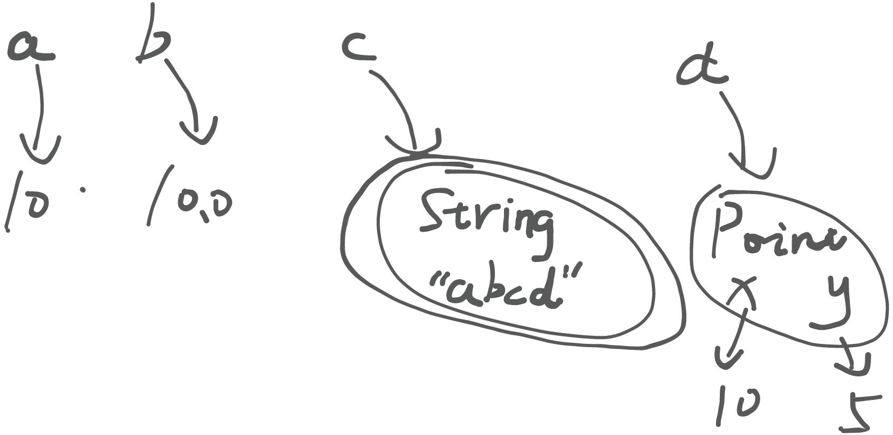
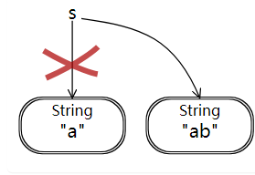
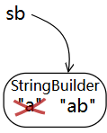
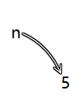
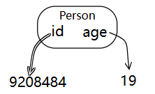
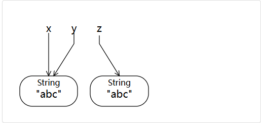

# Reading 2: Basic Java

# Snapshot Diagrams(快照图)
快照图可以表示程序在某一个运行时的内部状态，包括它的栈(存储正在运行的方法和局部变量)和堆(存储当前已存在的对象)。

下面有一个比较简单的示例：

```java
int a = 10;
double b = 10.0;
String c = "abcd";
Point p1 = new Point(10, 5); // Point(double x, double y)
```



# Mutating values VS Reassigning variables
快照图可以以一种直观的方式来区分更改值与重新分配变量的区别，我们有如下约定：

+ 当为变量或字段重新分配值时，改变当前变量箭头指向的对象为另一个值
+ 当修改一个可修改对象的内容(如数组等)时，改变这个值对应的引用

大致上可以分为以下几种具体情况：

## Reassignment and immutable values
```java
String s = "a";
s = s + "b";
s = "ab";
```



`String` 类型对象是**不可修改**的，因此 `s = s + "b"` 中，先由 `s + "b"` 生成了一个新的 `String` 类型对象， 再将变量 `s` 指向新生成的对象。

## Mutable values
虽然`String` 类型对象是**不可修改**的，但是 `StringBuilder` 类型对象是可修改值的，该类型对象的值也代表了一个字符串。

```java
StringBuilder sb = new StringBuilder("a");
sb.append("b");
```



可以看到，变量 `sb` 指向的对象并没有改变，但是对象值变了。

## Unreassignable references
使用 `final` 关键字即可声明一个无法被再次赋值的变量，例如：

```java
final int n = 5;
```



在变量 `n` 的整个生命周期中，它都无法被再次赋值了。如果你对这种类型的变量进行多次赋值，那么就会产生一个 `Compile Error`。在时序图中，为了展现出这种不可再次赋值性，我们可以使用双箭头来表明这是个无法再次赋值的变量。



当然，下面的示例也是可行的：

```java
final StringBuilder sb = new StringBuilder("a");
sb.append("bcde");
// it's okay, because the actual object the variable sb refers to didn't be reassigned.
```

## Exercise
<font style="color:rgb(51, 51, 51);">Here is a function that mutates and reassigns its parameters:</font>

```java
void f(String s, StringBuilder sb) {
    s.concat("b");
    s += "c";
    sb.append("d");
}
```

<font style="color:rgb(51, 51, 51);">Suppose it is called like this:</font>

```java
String t = "a";
StringBuilder tb = new StringBuilder(t);
f(t, tb);
```

+ <font style="color:rgb(51, 51, 51);">After this code runs, what sequence of characters does </font>`<font style="color:rgb(51, 51, 51);background-color:rgb(245, 245, 245);">t</font>`<font style="color:rgb(51, 51, 51);"> refer to?</font>
+ <font style="color:rgb(51, 51, 51);">At the same point, what sequence of characters does </font>`<font style="color:rgb(51, 51, 51);background-color:rgb(245, 245, 245);">tb</font>`<font style="color:rgb(51, 51, 51);"> refer to?</font>

<details class="lake-collapse"><summary id="u8c5cfc53"><span class="ne-text">Answer</span></summary><p id="uc9f727db" class="ne-p"><code class="ne-code"><span class="ne-text">t = &quot;a&quot;, tb = &quot;ad&quot;</span></code></p><p id="u18ac2944" class="ne-p" style="text-align: center"></p><p id="u4034bb65" class="ne-p" style="text-align: center"></p></details>
# `==` VS `equals()`
Java 中有两种方式来判断相等关系：

+ `==` ：用于比较**基本类型**的值是否相等，例如 `5 == 5`
+ `equals()` ：用于比较不可修改类型或**对象类型**的值是否相等，例如 `"abc".equals("abc)`

如果错误地使用 `equals()` 至基本类型的比对上(例如 `5.equals(5)`，Java 会在 Static check 阶段就检查出错误。但是如果将 `==` 用于对象类型的比对上，Java 则**不会**抛出 Static error，但是结果可能与你预期的结果大相径庭——因为 `==` 被用于对象类型的比对时，它被重载为检查这组待比对的值是否指向**同一个对象。**



对上面的快照图中呈现的状态，执行下列运算：

+ `x.equals(y)` -> `True`：Their values are equal
+ `x.equals(z)` -> `True`：The same reason
+ `x == z` -> `False`：`x` and `z` don't refer to the same object.
+ `x == y` -> `True` ： `x` and `y` do refer to the same object.

由此可以得到一个大体的使用规则：

+ <font style="color:rgb(51, 51, 51);">Use </font>`<font style="background-color:rgb(245, 245, 245);">==</font>`<font style="color:rgb(51, 51, 51);"> for comparing </font>**<font style="color:rgb(51, 51, 51);">primitive</font>**<font style="color:rgb(51, 51, 51);"> values, like ints, chars, and doubles.</font>
+ <font style="color:rgb(51, 51, 51);">Use </font>`<font style="background-color:rgb(245, 245, 245);">equals()</font>`<font style="color:rgb(51, 51, 51);"> for comparing </font>**<font style="color:rgb(51, 51, 51);">object</font>**<font style="color:rgb(51, 51, 51);"> values, like lists, arrays, strings, and other objects.</font>

# <font style="color:rgb(51, 51, 51);">Java Collections</font>
> 本部分在讲 Java 集合相关的常用方法等基本内容，故略过
>

# Enumerations
Benefits using enumerations:

+ more typesafe
+ prevents mistakes like type mismatches and misspellings

```java
int month = TUESDAY;  //  no error if integers are used
Month month = DayOfWeek.TUESDAY; // static error if enumerations are used 

String color = "REd";        // no error, misspelling isn't caught
PenColor drawingColor = PenColor.REd; // static error when enumeration value is misspelled
```

# Java API Documention
The JDK 21's API documention is [here](https://docs.oracle.com/en/java/javase/21/docs/api/).


> 更新: 2024-09-23 08:23:07  
> 原文: <https://www.yuque.com/yuqueyonghukaqxkk/self_learning_route/ybmgc7v0z0urgdfk>