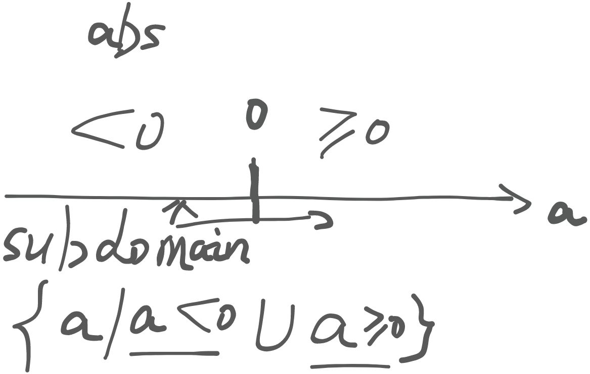
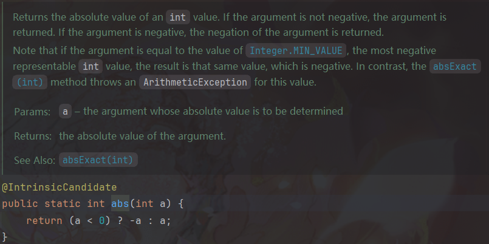
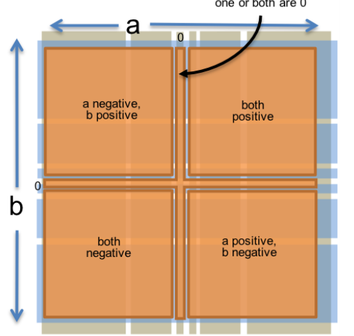
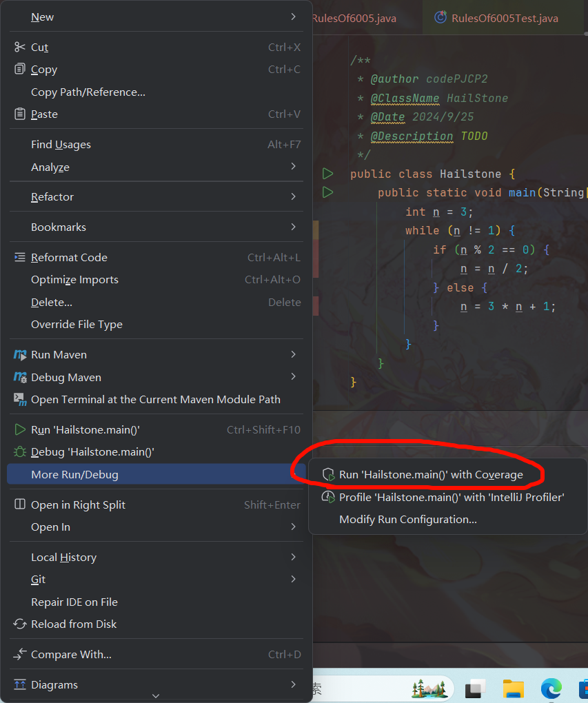
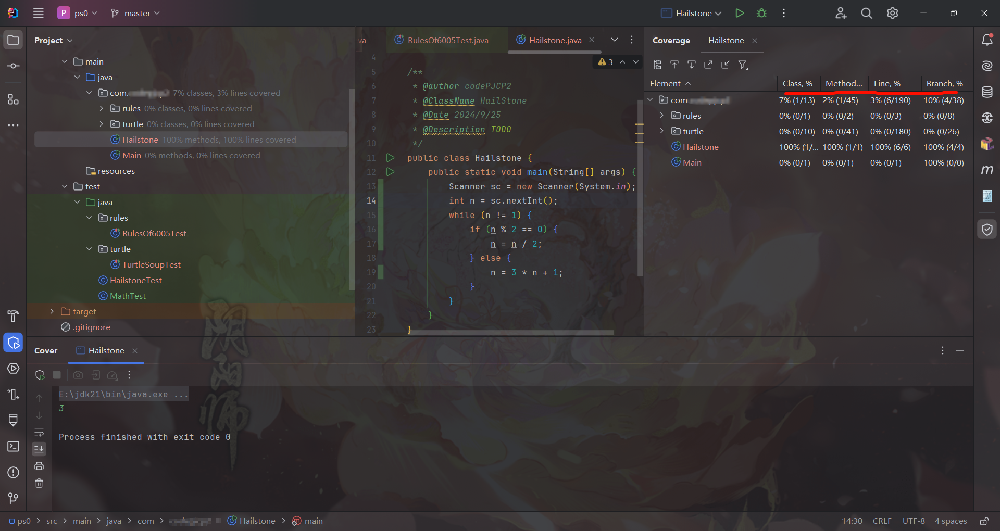
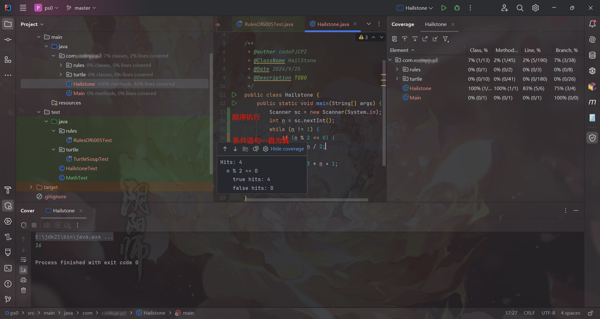
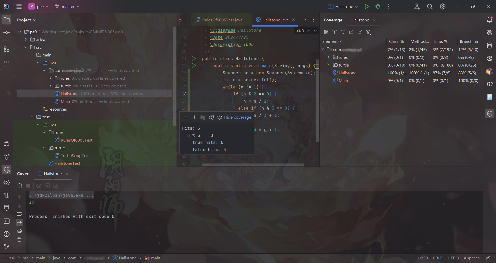

# Reading 3: Testing

# Test-first programming
<font style="color:rgb(51, 51, 51);">In </font>_<font style="color:rgb(0, 0, 0);">test-first programming</font>_<font style="color:rgb(51, 51, 51);">, you write the spec and the tests before you even write any code. The development of a single function proceeds in this order:</font>

1. **<font style="color:rgb(51, 51, 51);">Spec</font>**<font style="color:rgb(51, 51, 51);">: Write a specification for the function.</font>
2. **<font style="color:rgb(51, 51, 51);">Test</font>**<font style="color:rgb(51, 51, 51);">: Write tests that exercise the specification.</font>
3. **<font style="color:rgb(51, 51, 51);">Implement</font>**<font style="color:rgb(51, 51, 51);">: Write the implementation.</font>

<font style="color:rgb(51, 51, 51);">Once your implementation passes the tests you wrote, you're done.</font>

# <font style="color:rgb(51, 51, 51);">Systematic Testing</font>
穷举、随意或随机测试在对软件测试方面的表现都不尽人意，所以我们需要系统化测试。系统化测试意味着有原则的挑选测试用例，同时设计出具有如下三种理想属性的测试集：

+ **<font style="color:rgb(51, 51, 51);">Correct</font>**<font style="color:rgb(51, 51, 51);">. A correct test suite is a legal client of the specification, and it accepts </font>**<font style="color:rgb(51, 51, 51);">all</font>**<font style="color:rgb(51, 51, 51);"> legal implementations of the spec without complaint. This gives us the freedom to change how the module is implemented internally without necessarily having to change the test suite.</font>
+ **<font style="color:rgb(51, 51, 51);">Thorough</font>**<font style="color:rgb(51, 51, 51);">. A thorough test suite finds </font>**<font style="color:rgb(51, 51, 51);">actual</font>**<font style="color:rgb(51, 51, 51);"> bugs in the implementation, caused by mistakes that programmers are likely to make.</font>
+ **<font style="color:rgb(51, 51, 51);">Small</font>**<font style="color:rgb(51, 51, 51);">. A small test suite, with few test cases, is </font>**<font style="color:rgb(51, 51, 51);">faster</font>**<font style="color:rgb(51, 51, 51);"> to write in the first place, and </font>**<font style="color:rgb(51, 51, 51);">easier</font>**<font style="color:rgb(51, 51, 51);"> to update if the specification evolves. Small test suites are also faster to run. You will be able to run your tests more frequently if your test suites are small and fast.</font>

### <font style="color:rgb(51, 51, 51);">划分测试用例</font>
将输入选区依据一定原则划分成若干块**不互相覆盖**的区域，划分过后再从各个区域中选一个测试用例以组成测试用例集。这样处理过后的用例集更可能拥有上面提及的三种理想属性。

就像 jyy 老师在[绪论 4](https://www.yuque.com/yuqueyonghukaqxkk/self_learning_route/fn885gf3a1e9t4m4#DoIkr) 中给出的启发一样，我们可以利用待测试程序本身的性质来编写测试用例。

#### Example: 测试`Math.abs()` 方法
```java
/**
 * ...
 * @param a  the argument whose absolute value is to be determined
 * @return the absolute value of the argument.
 */
public static int abs(int a) {
    // ...
}
```



```java
// partition: a >= 0; a < 0
```

所以，我们从这两个选区中各选择一个测试用例组成测试集即可，例如：

+ $ a < 0 $：我们选取 `a = -3` 作为一个测试用例
+ $ a \geq 0 $：我们选取 `a = 999` 作为一个测试用例

#### 分区相关的一些描述词
+ `Disjoint`：不相交的
+ `Complete`：完整的，这里表示完整地覆盖原输入集
    - 一个**合法**的分区方案**一定**要符合的性质
+ `Correct`：正确的，表示输入符合待测试程序的 `specification`

### 将边界条件涵盖在分区中
不论是日常开发还是跟 OJ 斗得你死我活的时候，边界条件总是很容易引发 bug：

+ 正负数的临界点 - 0
+ 数值类型的最值：`INT_MAX`, etc.
+ 空集合
+ 序列的首尾元素

#### 再遇 `Math.abs()`
其实 2.2.1 节中给出的 `abs` 方法的 `specificaion` 并不是完整的，实际上，`abs` 方法的完整描述如下：



描述中明确提到了一个值——`Integer.MIN_VALUE`，当输入的参数为该值时，结果会与一般情况不同。

我们自己写了一个测试方法来测试 `abs` 方法返回结果与描述中的一致性：

```java
import org.testng.annotations.Test;

import static org.junit.jupiter.api.Assertions.*;

public class MainTest {

    @Test
    public void testMath() {
        assertEquals(1, Math.abs(1));
        assertEquals(2, Math.abs(-2));
        assertEquals(0, Math.abs(0));
        assertEquals(Integer.MIN_VALUE, Math.abs(Integer.MIN_VALUE));
        assertEquals(Integer.MAX_VALUE, Math.abs(Integer.MAX_VALUE));
        // Test passes when the statement below is commented out.
        assertNotEquals(Integer.MIN_VALUE, Math.abs(Integer.MIN_VALUE));
        // org.opentest4j.AssertionFailedError: 
        // expected: not equal but was: <-2147483648>
    }
}
```

所以从 [2.1.1 节](#rNXfj) 根据分区确定的测试用例集的基础上，我们可以加入如下的边界条件：

+ $ a = 0 $
+ `a = Integer.MAX_VALUE`
+ `a = Integer.MIN_VALUE`：注意，这和其余任何输入产生的行为均不同！

这样调整过后，我们对 `abs` 方法的输入分区如下：

```java
// partition:
//     a = Integer.MIN_VALUE
//     Integer.MIN_VALUE < a < 0
//     a = 0
//     0 < a < Integer.MAX_VALUE
//     a = Integer.MAX_VALUE
```

#### Example: `BigInteger.multiply()`
```java
/**
 * @param val another BigInteger
 * @return a BigInteger whose value is (this * val).
 */
public BigInteger multiply(BigInteger val)
```

根据乘法的一些性质，我们可以把输入用例大致分成几种情况：

> 假设 `a` 与 `b` 均为 `BigInteger` 对象
>

+ $ a > 0 $，$ b > 0 $
+ $ a > 0 $，$ b < 0 $
+ $ a < 0 $，$ b > 0 $
+ $ a < 0 $，$ b > 0 $
+ 不要忘了**边界**条件：$ a =0 $`||` $ b = 0 $；$ a = 1 $ `||` $ b = 1 $
+ 如果再考虑上常规数值类型的**最值**呢？

这样分区以后，我们一共得到了$ 6 \times 6 = 36 $种子区域。


### Using Multiple Partitions
可以看到，如果只使用一种分区的话，即使是只有两个参数的方法，也有多达 36 种分区情况，所以你可能会猜测，单类分区的分区情况总数可能会达到$ x ^ y $这个量级。也就是说，当参数个数$ x $以及单个参数对应的分界区域$ y $多了以后，这个情况总数(它直接关系到测试集内的用例数量)会成指数级增长。这是我们不希望看到的——测试用例集应该是一个规模较小的集合。

还是拿 [2.2.2 节](#NCfCz) 中介绍的例子 `BigInteger.multiply()`来说。我们之前只把参数的分区情况独立化了，但是有些情况下不同分区的预期结果是一致的，例如$ a = 0 $，$ b \neq 0 $与$ b = 0 $，$ a = 0 $这两种分区的预期结果是一致的(或者说，**有共性**的)。原本测试集中所涵盖的测试用例存在一些输入不同但预期结果“相同”的情况，因此，为了缩减测试用例集的规模，我们也许自然而然地就想着把这些结果一致的情况**合并**起来。

```java
// partition on a:
//   a = 0
//   a = 1
//   a is small integer > 1
//   a is small integer < 0
//   a is large positive integer
//   a is large negative integer
//      (where "small" fits in long, and "large" doesn't)
// partition on b:
//   b = 0
//   b = 1
//   b is small integer > 1
//   b is small integer < 0
//   b is large positive integer
//   b is large negative integer
```

```java
// partition on signs of a and b:
//    a and b are both positive
//    a and b are both negative
//    a positive and b negative
//    a negative and b positive
//    one or both are 0
```



我们的分区规模从原先的$ 36 $个缩减到了现在的$ 6 $个，这意味着测试集规模也可从原先的$ 36 $个缩减至$ 6 $个**<u>精心挑选</u>**的测试用例。

#### Exercise: Covering every subdomain vs. covering Cartesian product
```java
// partition on a:
//   a = 0
//   a = 1
//   a is small integer > 1
//   a is small integer < 0
//   a is large positive integer
//   a is large negative integer
//      (where "small" fits in long, and "large" doesn't)
```

这个分区有六个子域，因此需要六个不同的值来组成测试用例集。

如果我们用下面的分区规则来替代上面的分区：

```java
// partition on a: 0, positive, negative
// partition on a: 1, !=1
// partition on a: small (fits in long), large (doesn't fit in long)
```

**Q1**: 如果想要囊括这三个分区对应的**各个**子域中的情况，**至少**需要几个值？

<details class="lake-collapse"><summary id="u27c80bea"><span class="ne-text">Answer for Q1</span></summary><p id="ub1c09709" class="ne-p"><span class="ne-text">至少需要 3 个值，例如：</span></p><ul class="ne-ul"><li id="u663cb0d8" data-lake-index-type="0"><span id="J6Axi" class="ne-math"></span><span class="ne-text">：满足 </span><code class="ne-code"><span class="ne-text">0, != 1, small</span></code><span class="ne-text">三个子域的情况</span></li><li id="u6ed0c941" data-lake-index-type="0"><span id="auGow" class="ne-math"></span><span class="ne-text">：满足 </span><code class="ne-code"><span class="ne-text">1, positive</span></code><span class="ne-text"> 两个子域的情况</span></li><li id="u227358e4" data-lake-index-type="0"><span id="qFt32" class="ne-math"></span><span class="ne-text">：满足 </span><code class="ne-code"><span class="ne-text">negetive, large</span></code><span class="ne-text"> 两个子域的情况</span></li></ul><p id="u692c6562" class="ne-p"><span class="ne-text">所以至少需要 3 个值.</span></p></details>
**Q2**：如果想要囊括这三个分区**做笛卡尔积之后**的各个子域的情况，至少需要几个值？

<details class="lake-collapse"><summary id="u9e541f43"><span class="ne-text">Answer for Q2</span></summary><p id="ufe899d1c" class="ne-p"><span class="ne-text">首先我们要搞清楚这三个分区做笛卡尔积之后的子域划分情况：</span></p><pre data-language="java" id="Qww8i" class="ne-codeblock language-java"><code>// partition on a:
// 1. a = 0
// 2. a = 1
// 3. a &lt; 0 &amp;&amp; a &gt;= Long.MIN_VALUE
// 4. a &lt; Long.MIN_VALUE
// 5. a &gt; 0 &amp;&amp; a &lt;= Long.MAX_VALUE
// 6. a &gt; Long.MAX_VALUE</code></pre><p id="u69530008" class="ne-p"><span class="ne-text">一共是六个不相互覆盖的子域，且该划分是完整的。</span></p><p id="u0fd9a043" class="ne-p"><span class="ne-text">因此至少需要 6 个值。</span></p></details>
### 记录下你的测试策略
在创建测试集的过程中，记录下你的测试策略是一个很好的想法。一般来说，测试策略可以从以下三个方面来描述：

+ 分区情况
+ 分区对应的子域列表
+ 各个测试用例覆盖子域的情况

```java
public class MaxTest {
    /*
   * Testing strategy
   *
   * partition:
   *    a < b
   *    a > b
   *    a = b
   */

    // covers a < b
    @Test
    public void testALessThanB() {
        assertEquals(2, Math.max(1, 2));
    }
}
```

```java
public class Multiply {
    /*
   * Testing strategy
   *
   * cover the cartesian product of these partitions:
   *   partition on a: positive, negative, 0
   *   partition on b: positive, negative, 0
   *   partition on a: 1, !=1
   *   partition on b: 1, !=1
   *   partition on a: small (fits in a long value), or large (doesn't fit)
   *   partition on b: small, large
   * 
   * cover the subdomains of these partitions:
   *   partition on signs of a and b:
   *      both positive
   *      both negative
   *      different signs
   *      one or both are 0
   */

    // covers a is positive, b is negative, 
    //        a fits in long value, b fits in long value,
    //        a and b have different signs
    @Test
    public void testDifferentSigns() {
        assertEquals(BigInteger.valueOf(-146), BigInteger.valueOf(73).multiply(BigInteger.valueOf(-2)));
    }

    // covers a = 1, b != 1, a and b have same sign
    @Test
    public void testIdentity() {
        assertEquals(BigInteger.valueOf(33), BigInteger.valueOf(1).multiply(BigInteger.valueOf(33)));
    }
}
```

### Black-box and glass-box testing
+ **黑盒测试(Black box test)**是指**只**通过待测试内容的描述(`specification`)来设计测试用例集。
+ **“白”盒测试(Glass box test)**是指根据待测试内容的**具体实现**来设计相关的测试用例。如果待测试内容内部根据输入用例的不同选择不同的算法策略来进行实现，这种时候白盒测试就能测试地更为**充分**(Through)。

### 代码覆盖率(Coverage)
覆盖率是衡量一个测试用例集对待测试内容的测试**全面性** (Through) 的重要指标。

一般来说，覆盖率主要有以下三种：

+ **<font style="color:rgb(51, 51, 51);">Statement(</font>****<u><font style="color:rgb(51, 51, 51);">语句</font></u>****<font style="color:rgb(51, 51, 51);">) coverage</font>**<font style="color:rgb(51, 51, 51);">: is </font>**<font style="color:rgb(51, 51, 51);">every statement</font>**<font style="color:rgb(51, 51, 51);"> run by some test case? </font>**<font style="color:rgb(51, 51, 51);">(a common goal)</font>**
+ **<font style="color:rgb(51, 51, 51);">Branch(</font>****<u><font style="color:rgb(51, 51, 51);">分支</font></u>****<font style="color:rgb(51, 51, 51);">) coverage</font>**<font style="color:rgb(51, 51, 51);">: for every </font>`<font style="background-color:rgb(245, 245, 245);">if</font>`<font style="color:rgb(51, 51, 51);"> or </font>`<font style="background-color:rgb(245, 245, 245);">while</font>`<font style="color:rgb(51, 51, 51);"> statement in the program, are </font>**<font style="color:rgb(51, 51, 51);">both the true and the false direction</font>**<font style="color:rgb(51, 51, 51);"> taken by some test case? </font>**<font style="color:rgb(51, 51, 51);">(highly desirable)</font>**
+ **<font style="color:rgb(51, 51, 51);">Path(</font>****<u><font style="color:rgb(51, 51, 51);">程序执行路径</font></u>****<font style="color:rgb(51, 51, 51);">) coverage</font>**<font style="color:rgb(51, 51, 51);">: is every possible combination of branches — </font>**<font style="color:rgb(51, 51, 51);">every path</font>**<font style="color:rgb(51, 51, 51);"> through the program — taken by some test case? </font>**<font style="color:rgb(51, 51, 51);">(infeasible)</font>**

<font style="color:rgb(51, 51, 51);">就测试效果以及测试规模来说，</font>$ Path > Branch > Statement $<font style="color:rgb(51, 51, 51);">。</font>

<font style="color:rgb(51, 51, 51);">幸运的是，我们已经有了统计并展示覆盖率的工具，这项工具内置于 IDEA 中，只需右键你想要运行的程序代码，并且选择 </font>`<font style="color:rgb(51, 51, 51);">RunWithCoverage</font>`<font style="color:rgb(51, 51, 51);"> 选项即可。</font>



运行之后就可以看到当次执行的各项覆盖率：







根据上面的观察，我们可以把三类颜色代表的含义简要的解释如下：

+ 绿色：对于一般语句来说：运行过程中均被执行；对于条件来说：条件的各类情况均被覆盖到。
+ 黄色：测试情况单一，未覆盖到全部情况
+ 红色：测试过程中完全没被执行到的语句。


> 更新: 2024-09-25 19:56:07  
> 原文: <https://www.yuque.com/yuqueyonghukaqxkk/self_learning_route/dx4zdza1ypec9ovt>