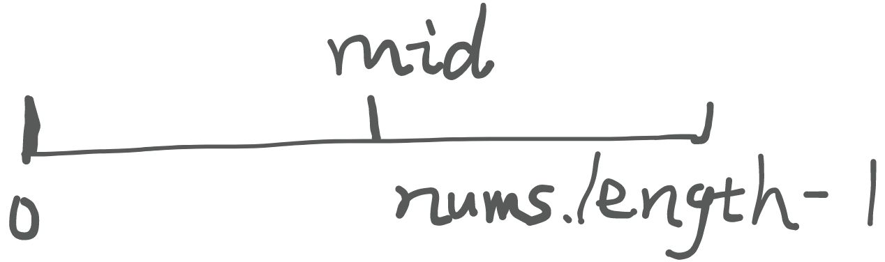
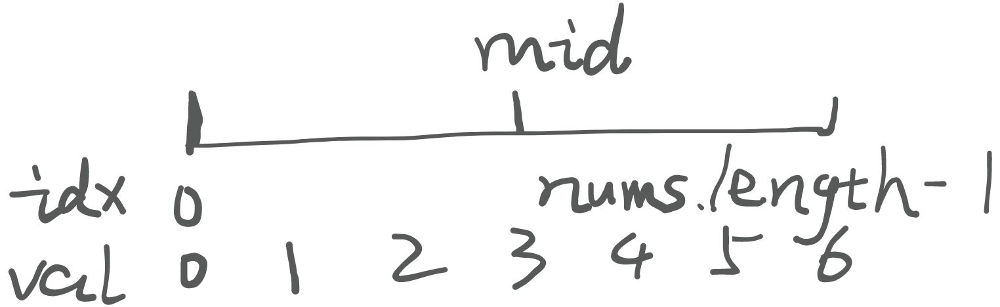

# 数组-1 2024/09/22

> 今日份题目：[2. 二分查找](https://programmercarl.com/0704.%E4%BA%8C%E5%88%86%E6%9F%A5%E6%89%BE.html) [3. 移除元素](https://programmercarl.com/0027.%E7%A7%BB%E9%99%A4%E5%85%83%E7%B4%A0.html) [4. 有序数组的平方](https://programmercarl.com/0977.%E6%9C%89%E5%BA%8F%E6%95%B0%E7%BB%84%E7%9A%84%E5%B9%B3%E6%96%B9.html)
>

## 二分查找
### 算法详解
循环不变量：**查找区间的闭合性**不变。例如：

+ 起始查找区间为$ [left, right] $这类左闭右闭的区间，那么后续查找区间也要符合这一闭合性。
+ 同理，$ [left, right) $ 这类左闭右开的区间，后续查找区间也要是左闭右开的。

让我们来看看 [Leetcode 754](https://leetcode.cn/problems/binary-search/description/) 这道题目：

给定一个 `n` 个元素**有序且不重复的（升序）**整型数组 `nums` 和一个目标值 `target`  ，写一个函数搜索 `nums` 中的 `target`，如果目标值存在返回下标，否则返回 `-1`。

这道题是最原汁原味的二分查找算法的实现，题目中包含**有序、不重复**等条件，因此可以容易的想到二分查找。

一般来说，典型的二分查找的代码实现类似于下面这样子：

```java
// ...
public int binarySearch(int[] nums, int target) {
    int left = 0, right = nums.length - 1;
    while(left ?? right)
    {
        int mid = left + (right - left) / 2; // avoiding protential overflow
        if(nums[mid] > target) {
            right = ??; 
        } else if(nums[mid] < target) {
            left = ??;
        } else {
            return mid;
        }
    }

    return -1;
}
```

根据查找区间闭合性的不同，`??` 区域待填充的代码也不同。当然，根据有序性的不同，判断条件也需要进行一定的修改，这里以升序为例。

本题中要查找的区间为左闭右闭区间$ [0, nums.length - 1] $。

<details class="lake-collapse"><summary id="uaacedc7c"><span class="ne-text">对应的左闭右开区间</span></summary><p id="u4af88bee" class="ne-p"><span id="Lk8dq" class="ne-math"></span></p></details>


在查找之前，首先需要检查区间的**合法性**。例如$ [1,1] $是合法的，而 $ [1, 1) $则是非法区间。若待搜索区间不合法，立即终止循环。因为左闭右闭区间的最小合法区间为$ [n, n] $，所以循环条件为 `left <= right` 。

<details class="lake-collapse"><summary id="u86117136"><span class="ne-text">根据上面的描述，你可以推导</span><strong><span class="ne-text">左闭右开区间</span></strong><span class="ne-text">的循环条件吗？</span></summary><p id="u1888365a" class="ne-p"><span class="ne-text">左闭右开的最小合法区间为</span><span id="LwDg6" class="ne-math"></span><span class="ne-text">，因此循环条件为 </span><code class="ne-code"><span class="ne-text">left &lt; right</span></code><span class="ne-text">。</span></p></details>
然后就是区间端点的转移了。需要注意，在整个查找过程中，待查找区间的合法性是**不变**的。因此在调整待查找区间的端点时，需要根据情况确定调整后端点的值。

下面假设 `nums[i] = i`，且 `nums.length = 7` 。



首次获得的 `mid`为 $ (0 + 6) / 2 = 3 $。我们可以根据 `target` 的取值来分析端点的移动情况：

+ $ target > nums[mid] = 3 $。由于数组是升序排列的，因此需要在右侧区间寻找，同时又因为 `mid` 下标对应的元素已经**明确小于 **`**target**`** ，**所以 `mid` 不应该被囊括到下一步待查找的区间中，由此可得$ left = mid + 1 $
+ $ target < nums[mid] = 3 $。此时需要在左侧区间寻找，类似于上面的分析，`mid` 不应该被包含在下一次待查找的区间中，可得$ right = mid - 1 $
+ $ target = nums[mid] = 3 $。都找到了，直接返回 `mid` 就好了。

这段分析同样可以应用于后续查找中，因为它们的查找逻辑完全一致。

<details class="lake-collapse"><summary id="u1eae2080"><span class="ne-text">类似于上面的推导，你可以推导</span><strong><span class="ne-text">左闭右开区间</span></strong><span class="ne-text">的端点移动情况吗？</span></summary><p id="uc2e8c861" class="ne-p"><span class="ne-text">首次获得的 </span><code class="ne-code"><span class="ne-text">mid</span></code><span class="ne-text"> 同样为 </span><span id="Vltod" class="ne-math"></span><span class="ne-text">。</span></p><ul class="ne-ul"><li id="ua290f7f3" data-lake-index-type="0"><span id="YO3wU" class="ne-math"></span><span class="ne-text">时， 需要在右侧区间中查找，根据查找区间的闭合性，可得</span><span id="d1Fwu" class="ne-math"></span></li><li id="u646ac620" data-lake-index-type="0"><span id="F6v3c" class="ne-math"></span><span class="ne-text">。此时需要在左侧区间寻找，根据查找区间的闭合性，可得</span><span id="U2NqI" class="ne-math"></span></li><li id="u0c6cafe8" data-lake-index-type="0"><span id="MZeBy" class="ne-math"></span><span class="ne-text">。直接返回 </span><code class="ne-code"><span class="ne-text">mid</span></code><span class="ne-text"> 。</span></li></ul></details>
### 相关题目
- [x] [<font style="color:rgb(44, 62, 80);">35.搜索插入位置</font>](https://programmercarl.com/0035.%E6%90%9C%E7%B4%A2%E6%8F%92%E5%85%A5%E4%BD%8D%E7%BD%AE.html)<font style="color:rgb(44, 62, 80);"> </font>[Leetcode 链接](https://leetcode.cn/problems/search-insert-position/description/) 
- [x] [<font style="color:rgb(44, 62, 80);">34.在排序数组中查找元素的第一个和最后一个位置</font>](https://programmercarl.com/0034.%E5%9C%A8%E6%8E%92%E5%BA%8F%E6%95%B0%E7%BB%84%E4%B8%AD%E6%9F%A5%E6%89%BE%E5%85%83%E7%B4%A0%E7%9A%84%E7%AC%AC%E4%B8%80%E4%B8%AA%E5%92%8C%E6%9C%80%E5%90%8E%E4%B8%80%E4%B8%AA%E4%BD%8D%E7%BD%AE.html)<font style="color:rgb(44, 62, 80);"> </font>[Leetcode 链接](https://leetcode.cn/problems/find-first-and-last-position-of-element-in-sorted-array/description/)
- [x] [<font style="color:rgb(44, 62, 80);">69.x 的平方根</font>](https://leetcode.cn/problems/sqrtx/)
- [x] [<font style="color:rgb(44, 62, 80);">367.有效的完全平方数</font>](https://leetcode.cn/problems/valid-perfect-square/)

## 移除数组
原题：[Leetcode 27](https://leetcode.cn/problems/remove-element/)

### 题目描述
<font style="color:rgb(38, 38, 38);">给你一个数组 </font>`<font style="color:rgba(38, 38, 38, 0.75);">nums</font>`_<font style="color:rgb(38, 38, 38);"> </font>_<font style="color:rgb(38, 38, 38);">和一个值 </font>`<font style="color:rgba(38, 38, 38, 0.75);">val</font>`<font style="color:rgb(38, 38, 38);">，你需要 </font>[**<font style="color:rgb(38, 38, 38);">原地</font>**](https://baike.baidu.com/item/%E5%8E%9F%E5%9C%B0%E7%AE%97%E6%B3%95)<font style="color:rgb(38, 38, 38);"> 移除所有数值等于 </font>`<font style="color:rgba(38, 38, 38, 0.75);">val</font>`_<font style="color:rgb(38, 38, 38);"> </font>_<font style="color:rgb(38, 38, 38);">的元素。元素的顺序可能发生改变。然后返回 </font>`<font style="color:rgba(38, 38, 38, 0.75);">nums</font>`<font style="color:rgb(38, 38, 38);"> 中与 </font>`<font style="color:rgba(38, 38, 38, 0.75);">val</font>`<font style="color:rgb(38, 38, 38);"> 不同的元素的数量。</font>

<font style="color:rgb(38, 38, 38);">假设</font><font style="color:rgb(38, 38, 38);"> </font>`<font style="color:rgba(38, 38, 38, 0.75);">nums</font>`<font style="color:rgb(38, 38, 38);"> </font><font style="color:rgb(38, 38, 38);">中不等于</font><font style="color:rgb(38, 38, 38);"> </font>`<font style="color:rgba(38, 38, 38, 0.75);">val</font>`<font style="color:rgb(38, 38, 38);"> </font><font style="color:rgb(38, 38, 38);">的元素数量为</font><font style="color:rgb(38, 38, 38);"> </font>`<font style="color:rgba(38, 38, 38, 0.75);">k</font>`<font style="color:rgb(38, 38, 38);">，要通过此题，您需要执行以下操作：</font>

+ <font style="color:rgb(38, 38, 38);">更改</font><font style="color:rgb(38, 38, 38);"> </font>`<font style="color:rgba(38, 38, 38, 0.75);">nums</font>`<font style="color:rgb(38, 38, 38);"> </font><font style="color:rgb(38, 38, 38);">数组，使</font><font style="color:rgb(38, 38, 38);"> </font>`<font style="color:rgba(38, 38, 38, 0.75);">nums</font>`<font style="color:rgb(38, 38, 38);"> </font><font style="color:rgb(38, 38, 38);">的前</font><font style="color:rgb(38, 38, 38);"> </font>`<font style="color:rgba(38, 38, 38, 0.75);">k</font>`<font style="color:rgb(38, 38, 38);"> </font><font style="color:rgb(38, 38, 38);">个元素包含不等于</font><font style="color:rgb(38, 38, 38);"> </font>`<font style="color:rgba(38, 38, 38, 0.75);">val</font>`<font style="color:rgb(38, 38, 38);"> </font><font style="color:rgb(38, 38, 38);">的元素。</font>`<font style="color:rgba(38, 38, 38, 0.75);">nums</font>`<font style="color:rgb(38, 38, 38);"> </font><font style="color:rgb(38, 38, 38);">的其余元素和</font><font style="color:rgb(38, 38, 38);"> </font>`<font style="color:rgba(38, 38, 38, 0.75);">nums</font>`<font style="color:rgb(38, 38, 38);"> </font><font style="color:rgb(38, 38, 38);">的大小并不重要。</font>
+ <font style="color:rgb(38, 38, 38);">返回 </font>`<font style="color:rgba(38, 38, 38, 0.75);">k</font>`<font style="color:rgba(38, 38, 38, 0.75);"> 。</font>

### <font style="color:rgba(38, 38, 38, 0.75);">暴力解法</font>
一种非常简单的思路是：

找到对应值的元素时，将后方所有元素前移一个位置以覆盖该元素，同时 `k--` 。

思路简单清晰，但是时间复杂度达到了$ O(N^2) $。

```java
// 时间复杂度：O(n^2)
// 空间复杂度：O(1)
class Solution {
public:
    int removeElement(vector<int>& nums, int val) {
        int size = nums.size();
        for (int i = 0; i < size; i++) {
            if (nums[i] == val) { // 发现需要移除的元素，就将数组集体向前移动一位
                for (int j = i + 1; j < size; j++) {
                    nums[j - 1] = nums[j];
                }
                i--; // 因为下标i以后的数值都向前移动了一位，所以i也向前移动一位
                size--; // 此时数组的大小-1
            }
        }
        return size;

    }
};
```

我们拿两层 `for` 循环做了两件事情：

+ 遍历数组，找对应元素 $ O(N) $
+ 找到之后，将该元素之后的所有元素前移 $ O(N) $

既然要在整个数组范围内删除元素，那么**一次遍历**肯定是跑不了的。

那么是否存在一种算法能在一次遍历的基础上直接完成这两件事情呢？

### 双指针解法(快慢指针)
别急，让**双指针**来救你！

我们把两层 `for` 循环的事情交给了一层 `for` 循环做，那当然得要拆出分别用于做两件事的内容了。这里就用到了快慢指针。

在这道题里面，通过快慢指针实现题目要求的思路为：

+ 快指针遍历数组，每次循环结束后自增
+ 慢指针指向新数组**当前**最后一个元素的后一个位置
+ 每当快指针遇到**非**待删除的值时，将快指针上位置的元素赋给慢指针上的元素，同时慢指针后移一个元素。否则快指针直接略过，无需做任何操作。

实现代码如下：

```java
public int removeElement(int[] nums, int val) {
    int slow = 0, fast = 0;
    while(fast < nums.length) {
        if(nums[fast] != val) {
            nums[slow] = nums[fast];
            slow++;
        }
        fast++;
    }

    return slow;
}
```

### 相关题目
- [x] [<font style="color:rgb(44, 62, 80);">26.删除排序数组中的重复项</font>](https://leetcode.cn/problems/remove-duplicates-from-sorted-array/)<font style="color:rgb(44, 62, 80);"> (快慢指针法)</font>
- [x] [<font style="color:rgb(44, 62, 80);">283.移动零</font>](https://leetcode.cn/problems/move-zeroes/)<font style="color:rgb(44, 62, 80);"> (快慢指针法)</font>
- [x] [<font style="color:rgb(44, 62, 80);">844.比较含退格的字符串</font>](https://leetcode.cn/problems/backspace-string-compare/)<font style="color:rgb(44, 62, 80);"> (栈/模拟构建/快慢指针法)</font>
- [x] [<font style="color:rgb(44, 62, 80);">977.有序数组的平方</font>](https://leetcode.cn/problems/squares-of-a-sorted-array/)<font style="color:rgb(44, 62, 80);"> (相向双指针法)</font>

## 有序数组的平方
原题：[Leetcode 977](https://leetcode.cn/problems/squares-of-a-sorted-array/description/)

### 题目描述
<font style="color:rgb(44, 62, 80);">给你一个按</font>**<font style="color:rgb(44, 62, 80);">非递减</font>**<font style="color:rgb(44, 62, 80);">顺序排序的整数数组 </font>`<font style="color:rgb(44, 62, 80);">nums</font>`<font style="color:rgb(44, 62, 80);">，返回</font>**<font style="color:rgb(44, 62, 80);">每个数字的平方</font>**<font style="color:rgb(44, 62, 80);">组成的新数组，要求也按</font>**<font style="color:rgb(44, 62, 80);">非递减</font>**<font style="color:rgb(44, 62, 80);">顺序排序。</font>

### 暴力解法
先把每个数字平方(原地)，再排序(使用$ O(N) $额外空间或者不使用均可)

```cpp
vector<int> sortedSquares(vector<int>& A) {
    for (int i = 0; i < A.size(); i++) {
        A[i] *= A[i];
    }
    sort(A.begin(), A.end()); // 快速排序
    return A;
}
```

### 双指针解法(相向双指针)
其实这个数组是按照**非递减顺序**来排列元素的，不过负数在平方之后的数值可能会很大。平方看似打乱了数组的有序性，但是根据原数组的非递减顺序可以推知，该平方数组是**由两边向中间逐渐减小**的。

借助这一性质，我们采用**相向双指针**法+$ O(N) $额外空间来解决问题：

+ 初始化左右指针以及新数组
+ 比较左右指针所处位置元素的绝对值(或平方值)。由于新数组也是非递减顺序，而原数组两端元素的平方值是最大的，所以从新数组**最右端**填充新数组内容。
+ 将较大者填充至新数组**未填充部分的最右侧(由 **`**pos**`** 变量维护)**，同时较大者对应下标需要**向中心靠拢**。
+ 循环这一过程，直至所有元素被填充到新数组中(标志：$ left > right $)

```java
public int[] sortedSquares(int[] nums) {
    int n = nums.length;
    int[] squareNums = new int[n];
    // 由于平方的特殊性，想要比大小需要从两端开始比较
    int left = 0, right = n - 1, pos = n - 1;
    // 指针位置相等的时候说明还有一个数字没有放进去，需要把它放进去再结束循环
    while(left <= right)
    {
        if(Math.abs(nums[left]) < Math.abs(nums[right])) {
            squareNums[pos--] = nums[right] * nums[right];
            right--;
        } else {
            squareNums[pos--] = nums[left] * nums[left];
            left++;
        }
    }

    return squareNums;
}
```

整个循环过程中只遍历了一遍原数组与新数组，因此时间复杂度为$ O(N) $。


> 更新: 2024-09-23 08:29:45  
> 原文: <https://www.yuque.com/yuqueyonghukaqxkk/self_learning_route/xqhuinvvudbqn083>