# Linux学习笔记

## 1. 常用快捷键
| 快捷键组合 | 快捷键作用 |
| :---: | :---: |
| `Ctrl + Alt + T` | 打开终端 |
| `Ctrl + k` | 删除当前光标至行末的所有文本 |
| `Ctrl + a` | 将光标移至当前行开头 |
| `Ctrl + e` | 将光标移至当前行结尾 |
| `Ctrl + d` | 结束键盘输入或者退出终端 |
| `Ctrl + s` | 暂停当前程序，暂停后按下任意键恢复运行 |
| `Ctrl + z` | 将当前程序放到后台运行   恢复到前台为命令`fg` |
| `Alt + Backspace` | 向前删除一个单词 |


## 2. Shell常用通配符
| 字符 | 含义 |
| :---: | :---: |
| * | 匹配0到多个字符 |
| ? | 匹配任意一个字符 |
| [list] | 匹配list中的任意单一字符 |
| [**^**list] | 匹配**除list中任意单一字符外**的任意单一字符 |
| [ch_1-ch_2] | 匹配从ch_1到ch_2范围内的任意单一字符 |
| (str_1, str_2, ...) | 匹配元组内的任意一个字符串 |
| {ch_1..ch_2} | 匹配ch_1到ch_2范围内的**全部**字符 |


## 3. Linux用户权限管理
### 3.1 查看用户相关信息
| 参数 | 说明 |
| :---: | :---: |
| `-a` | 打印能打印的全部信息 |
| `-d` | 打印死掉的进程信息列表 |
| `-m` | 同`am i`，`mom likes`，打印当前伪终端用户的相关信息 |
| `-q` | 打印当前登录用户数及用户名列表 |
| `-u` | 打印当前登录用户登录信息 |
| `-r` | 打印运行等级**(测试发现无结果，待查询)** |


### 3.2 创建用户
>   [!NOTE]
>
>   创建用户**需要root权限**！可以使用sudo命令暂时提升权限，但是使用sudo命令有一定前提：
>
> 1. 知道当前用户的密码
> 2. 当前用户**位于sudo用户组中**
>

#### 相关命令：su, -su, sudo
+ `su`命令用于切换用户身份，用法如下：

```bash
su [<选项参数>] <username>
```

其中选项参数为可选项，常用的选项参数有：

| 参数 | 说明 |
| :---: | :---: |
| 无 | 仅切换用户 |
| -, -l, --login | 切换用户，同时用户的环境变量和工作目录也会跟着改变成目标用户所对应的内容。 |


+ `sudo`命令用于以特权模式执行命令，使用前提已经在本节初给出

### 3.3 用户组
#### 查看用户组相关信息
##### 1. 使用groups命令
```bash
groups <username>
```

使用该命令即可查看用户名对应用户的用户组信息，示例如下：

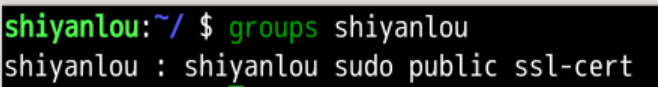

其中冒号左侧表示用户名，冒号右侧表示该用户所属权限组，例如上图中`shiyanlou`用户属于`shiyanlou`、`sudo`、`public`、`ssl-cert`这四个用户组。

##### 2.  查看/etc/group文件
有两种方式可以查看该文件：

1. 可以直接通过GUI界面来查找并在文本编辑器中查看文件内容，如下所示：  
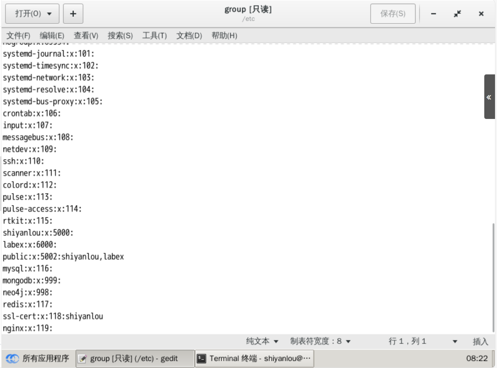
2. 如果希望在命令行中查看文件内容，则可以使用`cat`命令读取指定文件的内容并打印到终端输出，示例代码如下所示：

```bash
cat /etc/group | sort | grep -E "shiyanlou"
```

可以看到，示例代码之后跟了一些额外选项：

    1. `| sort`：该选项表示将读取的文本进行字典排序后再输出
    2. `| grep`：用于过滤结果，保留符合条件的行

##### 3. /etc/group文件格式
`/etc/group`文件中的内容包括<u>用户组名称（Group_Name）、用户组口令(Password)、GID（组 ID） 及该用户组所包含的用户列表（User_List）</u>，每个用户组一条记录。格式如下：

>   Group_Name:password:GID:User_List
>

观察文件中的neritic，经常会出现password 字段为一个 `x`的情况，这并不是说密码就是`x`，只是表示密码**不可见**而已。

这里需要注意，如果用户的 GID 等于用户组的 GID，那么最后一个字段 `User_List` 就是空的，这里的说的**用户GID是指用户默认所在组的 GID**，可以使用 `id` 命令查看(见下图)。比如 shiyanlou 用户，在 `/etc/group` 中的 shiyanlou 用户组后面是不会显示的。

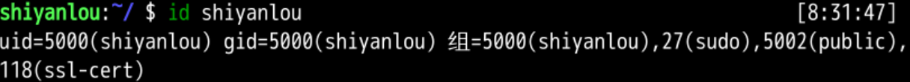

#### 将其余用户加入到指定用户组
可以使用`usermod`命令为用户添加用户组。

同样地，需要有root权限才能进行此操作，所以你可以选择：

1. 直接使用 root 用户为其它用户添加用户组
2. 用其它已经在 sudo 用户组的用户使用 sudo 命令获取权限来执行该命令

可以使用`-G`参数来指定待添加到的指定用户组名，示例命令如下：

```bash
sudo usermod -G sudo lilei
```

该命令可以将用户`lilei`加入到`sudo`用户组，执行结果如下所示：

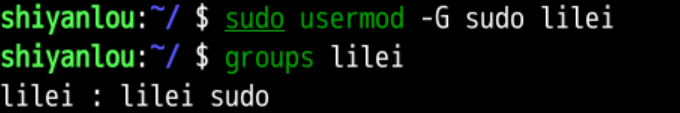

### 3.4 删除用户与用户组
#### 删除用户
使用`deluser`命令即可，示例命令如下：

```bash
sudo deluser lilei --remove-home
```

其中`--remove-home`参数在删除用户时候会一并**将该用户的工作目录一并删除**。如果不使用该参数，那么系统会自动在 `/home` 目录为该用户保留工作目录。

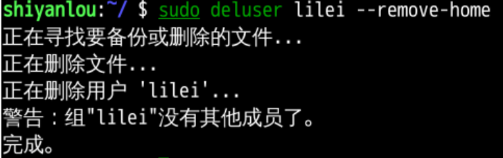

#### 删除用户组
使用`groupdel`即可将**不包含任何用户**的用户组删除。这也就意味着——如果待删除的用户组中包含用户，那么先需要将用户组中的所有用户删除，或者将这些用户移出该用户组。

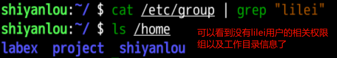

## 4. Linux文件权限管理
### 4.1 查看文件权限
不加任何参数的`ls`命令只能查看当前目录下的文件列表，当它加上参数之后，能做的远不止于此，下面我们就用它来查看各文件的查看权限。

执行下面的命令可以使用较长格式列出文件：

```bash
ls -l
```

明显可以看出来与不带参数的`ls`命令输出的结果有很大不同：

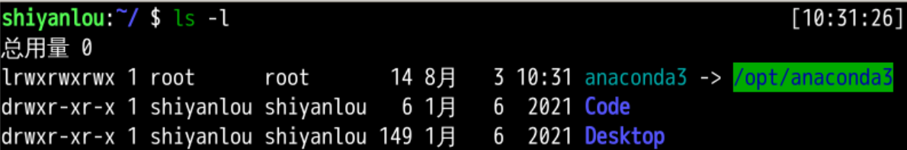

让我们稍微拆解一下每一行文件信息的内容格式：


我们一项项地来看：

+ 文件类型和权限  
下图详细拆解了文件类型和权限这一部分的内容：
    - 文件类型：  
关于文件类型，这里有一点你必需时刻牢记—— **<u>Linux 里面一切皆文件</u>**，正因为这一点才有了设备文件（ `/dev` 目录下有各种设备文件，大都跟具体的硬件设备相关）这一说。 
        * socket：网络套接字。
        * pipe 管道：这个东西**很重要**，之后会详细讨论。
        * 软链接文件：链接文件是分为两种的，另一种当然是“硬链接”（硬链接不常用，而**软链接等同于 Windows 上的快捷方式**，你记住这一点就够了）。
    - 文件权限：
        * 读权限：表示你可以使用 `cat <file name>` 之类的命令来**读取**某个文件的内容；
        * 写权限：表示你可以**编辑和修改**某个文件的内容；
        * 执行权限：通常指可以运行的二进制程序文件或者脚本文件，如同 Windows 上的 `.exe` 后缀的文件，不过 Linux 上**不通过文件后缀名来区分**文件的类型。

>   [!NOTE]
>
>   你需要注意的一点是，**一个目录同时具有读权限和执行权限才可以打开并查看内部文件，而一个目录要有写权限才允许在其中创建其它文件**，这是因为目录文件实际保存着该目录里面的文件的列表等信息。
>

        * 所有者权限：不用多说你也明白
        * 所属用户组权限：是指**你所在的用户组中**的**所有其它用户**对于该文件的权限
+ 链接数：链接到该文件所在的 `inode` 结点的文件名数目
+ 文件大小：以 `inode` 结点大小为单位来表示的文件大小，你可以给 `ls` 加上 `-lh` 参数来更直观的查看文件的大小。

#### ls命令常用参数
| 参数 | 说明 |
| :---: | :---: |
| -a | 显示除了 `.`（当前目录）和 `..`（上一级目录）之外的所有文件，包括隐藏文件 |
| -l | 使用较长格式列出本目录下的文件信息 |
| -al | `-a`和`-l`的结合 |
| -dl | 查看某一个目录的完整属性，而不是显示目录里面的文件属性 |
| -lh | _以人类可读的方式显示当前目录中的文件和目录大小_ |
| -alh | `-a`与`-lh`的结合 |
| -asSh | 显示所有文件大小，并以普通人类能看懂的方式呈现   其中小 s 为显示文件大小，大 S 为按文件大小排序 |


### 4.2 变更文件所有者
使用`chown`命令即可变更文件所有者，需要root权限执行操作。示例代码如下：

```bash
sudo chown shiyanlou(变更后的文件所有者) iphone11(待更新的文件名称)
```

### 4.3 修改文件权限
#### 文件权限的表示方法
1. 二进制数字表示  
该方法使用二进制数字表示对应的权限：有对应权限则该位为1，否则为0  
权限数字的表示顺序是固定的，都遵循**“读写执行”**这一规则，由高位向低位排列，如下图：  
例如$ rwx = (111)_2 = (7)_{10} $。  
每个文件有**三组**固定的权限，分别对应**拥有者**，**所属用户组**，**其他用户**，**这个顺序是固定的**。  
例如$ rwx-wx-w- = (111)_2 (011)_2 (010)_2 = (7 3 2)_{10} $

可以使用`chmod`命令来修改指定文件的文件权限，如下图：

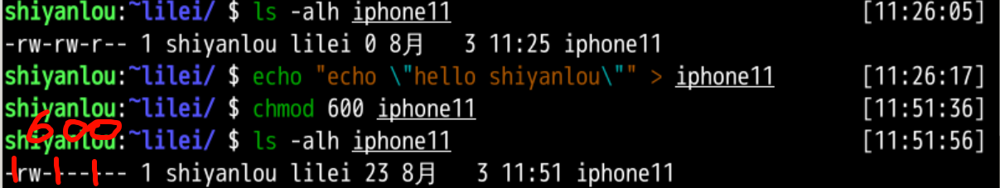

2. 加减赋值法  
示例代码：

```bash
chmod go-rw iphone11
```

其中`g`、`o` 还有 `u` 分别表示 group（用户组）、others（其他用户） 和 user（用户），`+` 和 `-` 分别表示增加和去掉相应的权限。

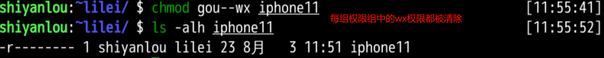

### 4.4 Extra
>   [!NOTE]
>
>   `adduser` 和 `useradd` 的区别是什么？
>

答：`useradd` 只创建用户，不会创建用户密码和工作目录，创建完了需要使用 `passwd <username>` 去设置新用户的密码。`adduser` 在创建用户的同时，会创建工作目录和密码（提示你设置），做这一系列的操作。其实 `useradd`、`userdel` 这类操作更像是一种命令，执行完了就返回。而 `adduser` 更像是一种程序，需要你输入、确定等一系列操作。

## 5. Linux目录结构
### 5.1 FHS标准
在Linux中，大部分目录结构是规定好了的，由**FHS标准**进行规定。Linux系统的正常运行以目录结构为基础，因此掌握各目录的结构十分重要。

>   [!NOTE]
>
>   FHS（英文：Filesystem Hierarchy Standard 中文：文件系统层次结构标准），多数 Linux 版本采用这种文件组织形式，FHS 定义了系统中每个区域的用途、所需要的最小构成的文件和目录同时还给出了例外处理与矛盾处理。
>

FHS标准中定义了两层规范：

1. `/` 下面的各个目录应该要放什么文件数据，例如 `/etc` 应该放置设置文件，`/bin` 与 `/sbin` 则应该放置可执行文件等等。
2. 第二层则是针对 `/usr` 及 `/var` 这两个目录的子目录来定义。例如 `/var/log` 放置系统日志文件，`/usr/share` 放置共享数据等等。


FHS 依据**文件系统使用的频繁与否**以及**是否允许用户随意改动**（不是不能改动），将目录定义为四种交互作用的形态，如下表所示：


### 5.2 目录路径
#### 使用cd命令切换目录
可以使用`cd`命令切换当前所在目录，示例如下：

```bash
cd .	# .表示当前目录

cd ..	# ..表示上一级目录

cd ~	# ~表示当前用户家目录

cd -  # 可用于返回上次所在的目录
```

使用`pwd`命令获取当前所在的绝对路径：

```bash
pwd		# /home/shiyanlou
```

#### 寻找指定程序路径
可以使用 `which`来寻找指定命令的路径，示例如下：

```bash
which sudo # /usr/bin/sudo
```

#### 绝对路径与相对路径
1. 绝对路径：简单来说就是从根路径`/`到当前所在目录的路径，例如`/home/shiyanlou/test`
2. 相对路径：以**当前目录**`.`为起点，用户指定的目录为终点，这段路径被称为相对路径。可以使用`../`表示上一级目录，使用`./`表示当前目录。

下面是使用绝对路径和相对路径的示例：

```bash
cd /usr/home/test # 绝对路径

cd ../usr/home/test # 相对路径
```

## 6. Linux文件操作
### 6.1 新建文件
#### 新建空白文件
使用`touch`命令创建新的空白文件，可以使用`{x..y}`等通配符。

```bash
touch myfile{1..5}.txt
```

#### 新建目录
使用`mkdir`命令可以创建目录。

1. 创建空目录

```bash
mkdir <目录名>
```

2. 创建带有父目录的目录——使用`-p`参数

```bash
mkdir -p father/son/grandson
```

### 6.2 复制文件
#### 复制文件
可以使用`cp`命令将文件复制到指定目录下：

```bash
# cp <filename> <path>
cp test father/son/grandson
```

#### 复制目录
如果直接使用 `cp` 命令复制一个目录的话，会出现如下错误：

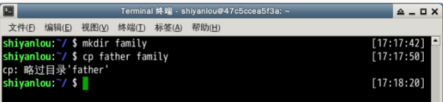

要成功复制目录需要加上 `-r` 或者 `-R` 参数，表示递归复制，将原目录下的内容全部复制到对应路径下：

```bash
mkdir family
cp -r father family
```

### 6.3 删除文件
#### 删除文件
使用`rm`命令删除一个文件：

```bash
rm test
```

有时候需要删除一些为只读权限的文件，直接使用 `rm` 删除会显示下面的提示：

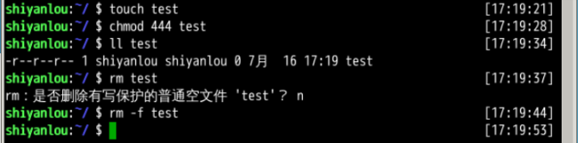

如果想要忽略提示强制删除该文件，则可以加上`-f`参数来强制删除文件：

```bash
rm -f test
```

#### 删除目录
跟复制目录一样，删除目录时需要加上`-r`参数进行递归删除：

```bash
rm -r family

rm -rf family	# 强制删除目录
```

还有一个命令支持删除目录的操作：`rmdir`，它仅能够用于删除空文件夹：

```bash
# 假设temp文件夹中存放有temp1.txt这个文本文件
rmdir temp
# rmdir: failed to remove 'temp': Directory not empty
```

### 6.4 移动文件与重命名
#### 移动文件
使用`mv`命令移动文件（剪切操作），命令格式如下：

```bash
mv 源目录文件 目的目录
```

#### 文件重命名
`mv` 命令除了能移动文件外，还能给文件重命名，命令格式为：

```bash
mv 旧的文件名 新的文件名
```

#### 批量重命名
单纯使用`mv`命令进行大量重命名操作显得力不从心，这时可以使用`rename`命令结合正则表达式来进行批量重命名操作。

```plain
cd /home/shiyanlou/

# 使用通配符批量创建 5 个文件:
touch file{1..5}.txt

# 批量将这 5 个后缀为 .txt 的文本文件重命名为以 .c 为后缀的文件:
rename 's/\.txt/\.c/' *.txt

# 批量将这 5 个文件，文件名和后缀改为大写:
rename 'y/a-z/A-Z/' *.c
```

简单解释一下上面的命令：`rename` 是先使用第二个参数的通配符匹配所有后缀为 `.txt` 的文件，然后使用第一个参数提供的正则表达式将匹配的这些文件的 `.txt` 后缀替换为 `.c`。

### 6.5 查看文件内容
#### 使用 `cat`，`tac` 和 `nl` 命令查看文件
前两个命令都是用来打印文件内容到标准输出（终端），其中 `cat` 为**正序**显示，`tac` 为**倒序**显示，可以加上`-n`参数显示行号。

>   [!NOTE]
>
>   标准输入输出：当我们执行一个 shell 命令行时通常会自动打开三个标准文件，即标准输入文件（stdin），默认对应终端的键盘、标准输出文件（stdout）和标准错误输出文件（stderr），后两个文件都对应被重定向到终端的屏幕，以便我们能直接看到输出内容。进程将从标准输入文件中得到输入数据，将正常输出数据输出到标准输出文件，而将错误信息送到标准错误文件中。
>

`nl` 命令可以添加行号并打印文件内容，常用参数如下：

```plain
-b : 指定添加行号的方式，主要有两种：
    -b a:表示无论是否为空行，同样列出行号("cat -n"就是这种方式)
    -b t:只列出非空行的编号并列出（默认为这种方式）
-n : 设置行号的样式，主要有三种：
    -n ln:在行号字段最左端显示
    -n rn:在行号字段最右边显示，且不加 0
    -n rz:在行号字段最右边显示，且加 0
-w : 行号字段占用的位数(默认为 6 位)
```

#### 使用 `more` 和 `less` 命令分页查看文件
`less` 的使用基本和 `more` 一致，这里只以介绍 `more` 命令的使用为例。

使用 `more` 命令打开 `passwd` 文件：

```bash
more passwd
```

输出的结果如下：

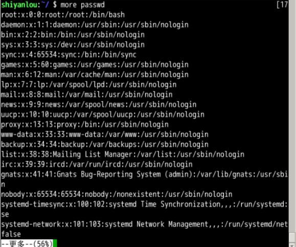

可以看到，打开后默认**只显示一屏内容**，终端底部显示当前阅读的进度。可以使用 `Enter` 键向下滚动一行，使用 `Space` 键向下滚动一屏，按下 `h` 显示帮助，`q` 退出。

#### 使用 `head` 和 `tail` 命令查看文件
这两个命令用于查看文件头/尾的几行(默认为**10行**，不足则全部显示)，示例结果如下：

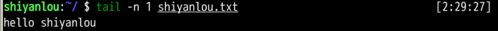

### 6.6 查看文件类型
可以使用 `file` 命令查看文件的类型：

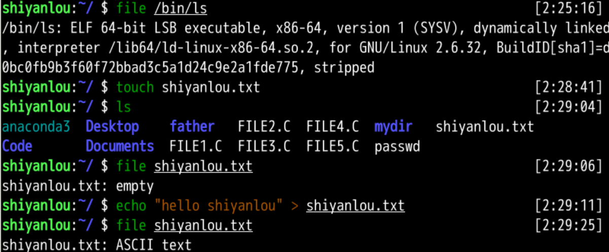


> 更新: 2024-09-14 13:10:50  
> 原文: <https://www.yuque.com/yuqueyonghukaqxkk/self_learning_route/homvi219ybb1lnqm>