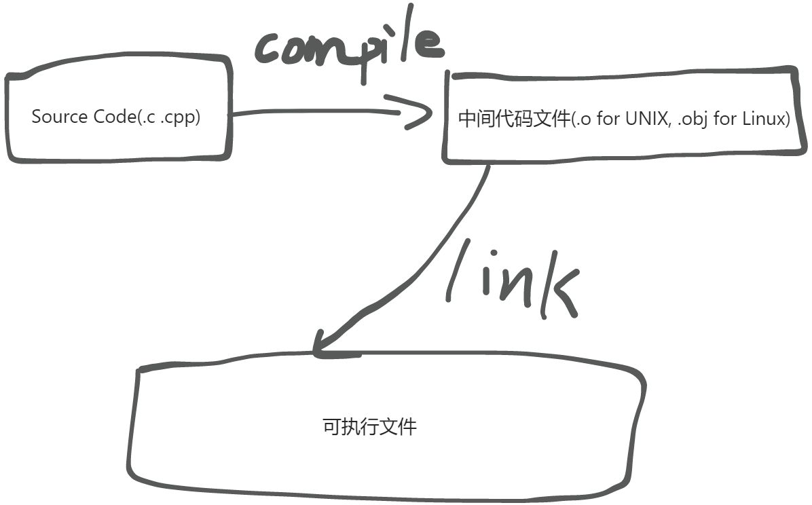

# Make & Makefile

> 前言：
>
> 当前学习 MAKE 的主要需求：修改 jyy 老师提供实验代码框架中的 makefile 文件，使其不自动提交到 jyy 老师的 OJ 中，而是提交到自己的私人仓库 **os-lab** 中。
>

# 编译与链接
简单来说，C/C++程序从源代码文件转化到可执行文件需要两个步骤：编译与链接



编译(Compile)：检测**<font style="color:rgb(64, 64, 64);background-color:rgb(252, 252, 252);">语法</font>**<font style="color:rgb(64, 64, 64);background-color:rgb(252, 252, 252);">的正确，</font>**<font style="color:rgb(64, 64, 64);background-color:rgb(252, 252, 252);">函数与变量的声明</font>**<font style="color:rgb(64, 64, 64);background-color:rgb(252, 252, 252);">的正确。</font>

<font style="color:rgb(64, 64, 64);background-color:rgb(252, 252, 252);">链接(Link)：链接</font>**<font style="color:rgb(64, 64, 64);background-color:rgb(252, 252, 252);">函数和全局变量</font>**<font style="color:rgb(64, 64, 64);background-color:rgb(252, 252, 252);">，会在所有的Object File中找寻函数的实现.</font>

# Makefile
## `<font style="color:rgb(64, 64, 64);background-color:rgb(252, 252, 252);">Makefile</font>` 的规则
Makefile 的一般规则如下：

```makefile
# 一般规则
target ... : prerequisites ...
    recipe
    ...
    ...

# 示例 Makefile
hello:hello.c
    gcc hello.c -o hello    # 注意开头的tab, 而不是空格

.PHONY: clean # 表示clean是个伪目标

# 特殊的 clean 规则
clean:
    rm hello    # 注意开头的tab, 而不是空格
```

分别讲解一下规则中的三个部分：

1. `target` ：一般情况下是目标文件名。这部分<font style="color:rgb(64, 64, 64);background-color:rgb(252, 252, 252);">可以是一个object file（目标文件），也可以是一个可执行文件，还可以是一个标签（label）。</font>
2. `<font style="color:rgb(64, 64, 64);background-color:rgb(252, 252, 252);">prerequisites</font>`<font style="color:rgb(64, 64, 64);background-color:rgb(252, 252, 252);"> ： 生成该target所依赖的文件。</font>
3. `<font style="color:rgb(64, 64, 64);background-color:rgb(252, 252, 252);">recipe</font>`<font style="color:rgb(64, 64, 64);background-color:rgb(252, 252, 252);"> ： 该target要执行的命令（任意的shell命令）。</font>

`<font style="color:rgb(64, 64, 64);background-color:rgb(252, 252, 252);">Make</font>`<font style="color:rgb(64, 64, 64);background-color:rgb(252, 252, 252);"> 的编译链接规则大致是这样的：</font>

1. <font style="color:rgb(64, 64, 64);background-color:rgb(252, 252, 252);">如果这个工程没有编译过，那么我们的所有文件都要编译并被链接。</font>
2. <font style="color:rgb(64, 64, 64);background-color:rgb(252, 252, 252);">如果这个工程的某几个文件被修改，那么我们只编译被修改的文件，并链接目标程序。</font>
3. <font style="color:rgb(64, 64, 64);background-color:rgb(252, 252, 252);">如果这个工程的头文件被改变了，那么我们需要编译引用了这几个头文件的文件，并链接目标程序。</font>

<font style="color:rgb(64, 64, 64);background-color:rgb(252, 252, 252);">因此，</font>`<font style="color:rgb(64, 64, 64);background-color:rgb(252, 252, 252);">Makefile</font>`<font style="color:rgb(64, 64, 64);background-color:rgb(252, 252, 252);"> 规则的执行规则大致可以描述如下：</font>

<font style="color:rgb(64, 64, 64);background-color:rgb(252, 252, 252);">如果 prerequisites 文件列表中存在比 target 更新的文件的话，规则中的 recipe 部分的命令就会被执行，否则不执行。</font>

## <font style="color:rgb(64, 64, 64);background-color:rgb(252, 252, 252);">在 Makefile 中使用变量</font>
跟常规编程意义上的变量类似，变量可以被类似如下方式定义：

```makefile
objs = main.o list.o
```

想要使用变量值，与 Shell 中访问变量值的方式有一点类似：

```makefile
# Makefile
$(objs)

# Shell
$objs
```

## 让 Make 进行自动推导
GNU Make 的功能很强大，它可以在**一定程度上**自动推导文件依赖关系以及待执行的命令。

只要make看到一个 `.o` 文件，它就会自动的把 `.c` 文件加在依赖关系中，并且相应的 `gcc -c xx.c` 命令也会被自动推导出来。

## GNU Make 的执行流程
<font style="color:rgb(64, 64, 64);background-color:rgb(252, 252, 252);">GNU Make 工作时的执行步骤如下：</font>

1. <font style="color:rgb(64, 64, 64);background-color:rgb(252, 252, 252);">读入所有的Makefile。</font>
2. <font style="color:rgb(64, 64, 64);background-color:rgb(252, 252, 252);">读入被 include 的其它Makefile。</font>
3. <font style="color:rgb(64, 64, 64);background-color:rgb(252, 252, 252);">初始化文件中的变量。</font>
4. <font style="color:rgb(64, 64, 64);background-color:rgb(252, 252, 252);">推导隐式规则，并分析所有规则。</font>
5. <font style="color:rgb(64, 64, 64);background-color:rgb(252, 252, 252);">为所有的目标文件创建依赖关系链。</font>

---

6. <font style="color:rgb(64, 64, 64);background-color:rgb(252, 252, 252);">根据依赖关系，决定哪些目标要重新生成。</font>
7. <font style="color:rgb(64, 64, 64);background-color:rgb(252, 252, 252);">执行生成命令。</font>

<font style="color:rgb(64, 64, 64);background-color:rgb(252, 252, 252);">这些执行步骤可以被分为两个阶段： 1-5步为第一个阶段，6-7为第二个阶段。第一个阶段中，如果定义的变量被使用了，那么，make会把其展开在使用的位置。但make并不会完全马上展开，make使用的是拖延战术，如果变量出现在依赖关系的规则中，那么仅当这条依赖被决定要使用了，变量才会在其内部展开。</font>


> 更新: 2024-09-18 17:00:24  
> 原文: <https://www.yuque.com/yuqueyonghukaqxkk/self_learning_route/fhf3cpssnnkvadh6>