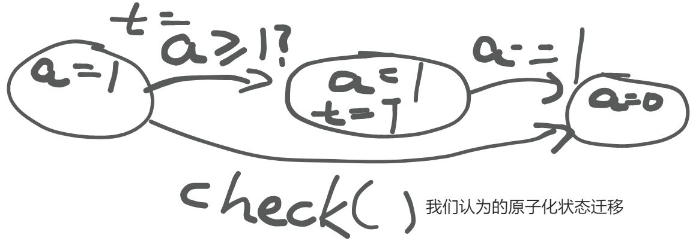
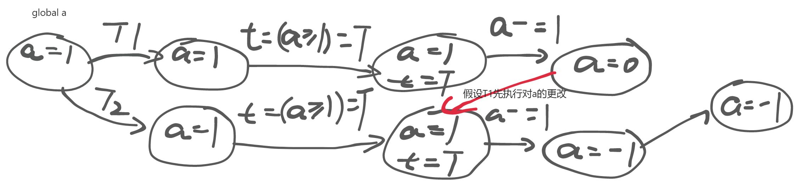
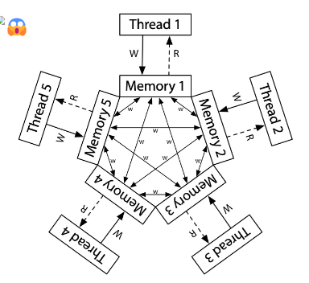
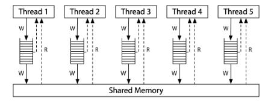
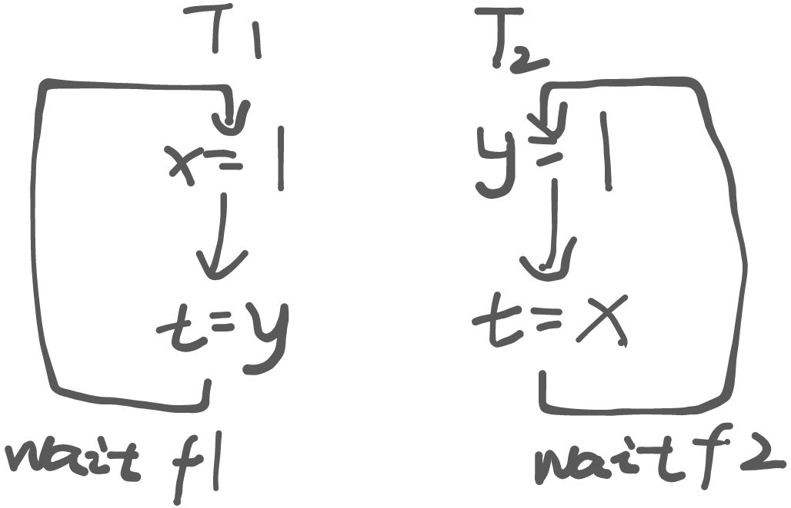
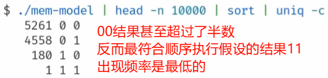

# 并发-1 多处理器编程: 从入门到放弃

## 多处理器编程 - 入门
### 什么是多线程
操作系统 -> (管理) 多个进程

一个进程 -> (拥有) 多个线程 (开始套娃了)

这就是多线程。

### 多线程编程模型 (状态机模型)
多个共享内存的状态机

+ <font style="color:rgb(31, 35, 40);">C 语言状态机的多个线程</font>
    - <font style="color:rgb(31, 35, 40);">共享所有全局变量</font>
    - <font style="color:rgb(31, 35, 40);">独立的栈帧列表</font>
+ <font style="color:rgb(31, 35, 40);">汇编语言状态机的多个线程</font>
    - <font style="color:rgb(31, 35, 40);">共享一个地址空间</font>
    - <font style="color:rgb(31, 35, 40);">独立的寄存器 (SP 指向不同内存位置)</font>

<font style="color:rgb(20, 20, 20);">状态迁移</font>

+ <font style="color:rgb(31, 35, 40);">选择</font>**任意一个线程**<font style="color:rgb(31, 35, 40);">执行一步</font>

### <font style="color:rgb(31, 35, 40);">多线程编程入门</font>
只需要 2 个 API 即可实现入门!

+ `<font style="color:rgb(31, 35, 40);">spawn(fn)</font>`
    - <font style="color:rgb(31, 35, 40);">创建一个入口函数是</font><font style="color:rgb(31, 35, 40);"> </font>`<font style="color:rgb(31, 35, 40);">fn</font>`<font style="color:rgb(31, 35, 40);"> </font><font style="color:rgb(31, 35, 40);">的线程，并立即开始执行</font>
        * `<font style="color:rgb(31, 35, 40);">void fn(int tid) { ... }</font>`
        * <font style="color:rgb(31, 35, 40);">参数</font><font style="color:rgb(31, 35, 40);"> </font>`<font style="color:rgb(31, 35, 40);">tid</font>`<font style="color:rgb(31, 35, 40);"> </font><font style="color:rgb(31, 35, 40);">从 1 开始编号</font>
    - <font style="color:rgb(31, 35, 40);">行为：</font>`<font style="color:rgb(31, 35, 40);">sys_spawn(fn, tid)</font>`
    - <font style="color:rgb(31, 35, 40);">特殊说明: 该函数会把 </font>`<font style="color:rgb(31, 35, 40);">tid</font>`<font style="color:rgb(31, 35, 40);"> 当作入参</font>
+ `<font style="color:rgb(31, 35, 40);">join()</font>`
    - <font style="color:rgb(31, 35, 40);">等待所有运行线程的返回 (也可以不调用)</font>
    - <font style="color:rgb(31, 35, 40);">行为：</font>`<font style="color:rgb(31, 35, 40);">while (done != T) sys_sched()</font>`

```c
#include "thread.h"

void T_a() { while (1) { printf("a"); } }
void T_b() { while (1) { printf("b"); } }

int main() {
    create(T_a);
    create(T_b);
}
```

<font style="color:rgb(31, 35, 40);">操作系统会自动把线程放置在不同的处理器上，因此在运行这个入门程序之后，你可以看到 CPU 使用率超过 100% 的情况。</font>

### <font style="color:rgb(31, 35, 40);">留给自己的思考题(日后回来看看)</font>
1. `<font style="color:rgb(20, 20, 20);">T_a</font>`<font style="color:rgb(20, 20, 20);"> 和 </font>`<font style="color:rgb(20, 20, 20);">T_b</font>`<font style="color:rgb(20, 20, 20);"> 真的共享内存吗？如何证明?</font>
2. <font style="color:rgb(20, 20, 20);">如何证明线程具有独立堆栈 (以及确定堆栈的范围)？</font>

<details class="lake-collapse"><summary id="u28a21f1a"><span class="ne-text">问题 2 提示</span></summary><p id="u16d4f3eb" class="ne-p"><span class="ne-text" style="color: rgb(31, 35, 40)">输出混乱，应该如何处理？</span></p></details>
## 多处理器编程 - 放弃: 操作的原子性
### 原有误区
在原先不涉及到并发编程的时候，我们总是隐式认为：

**“世界上仅有一个状态机”，没有任何东西能干涉程序的状态。**

因此，对于任何一个包含多步骤的函数调用，我们总是假想成原子性的迁移。



但是在并发程序中，可能会出现下面的情况：



<font style="color:rgb(15, 23, 42);">“世界上只有一个状态机” 的假设在共享内存并发模型下被打破了。进而，每一次内存 </font>`<font style="color:rgb(15, 23, 42);">load</font>`<font style="color:rgb(15, 23, 42);"> 都可能会读到其他线程覆盖写入的值——这给并发编程带来了很大的麻烦。</font>

### <font style="color:rgb(31, 35, 40);">并行 1 + 1</font>
```c
#include "thread.h"

#define N 100000000

long sum = 0;

void T_sum() {
    for (int i = 0; i < N; i++) {
        // sum++;

        // Won't work even if we force a single-instruction
        // increment.

        asm volatile(
            "incq %0" : "+m"(sum)
        );
    }
}

int main() {
    create(T_sum);
    create(T_sum);

    join();

    printf("sum = %ld\n", sum);
    printf("2*n = %ld\n", 2L * N);
}
```

```plain
sum = 103766919
2*n = 200000000
```

### (思考题) 构造最小调度
```python
def T_sum():
    for _ in range(3):
        t = heap.sum
        sys_sched()
        t = t + 1
        heap.sum = t
        sys_sched()
    sys_write(f'sum = {heap.sum}\n')

def main():
    heap.sum = 0
    sys_spawn(T_sum)
    sys_spawn(T_sum)
    sys_spawn(T_sum)
```

## 多处理器编程 - 放弃: <font style="color:rgb(15, 23, 42);">程序顺序执行的假设</font>
很不幸，编译器也做了我们先前提到的隐含假设——如果编译器要考虑并行情况，那它还怎么做编译优化呢？

**<font style="color:rgb(31, 35, 40);">在这个假设下，编译器会试图优化状态迁移，改变执行流。</font>**

**但是，共享内存****<font style="color:rgb(20, 20, 20);">推翻了编译器的假设</font>**

+ <font style="color:rgb(31, 35, 40);">但编译器依然会按照顺序执行优化代码</font>
+ <font style="color:rgb(31, 35, 40);">否则几乎任何涉及共享内存的代码都变得 </font>**<font style="color:rgb(31, 35, 40);">“不可优化”</font>**

**<font style="color:rgb(20, 20, 20);">程序的行为在并发编程下变得更难理解了</font>**

+ <font style="color:rgb(31, 35, 40);">“顺序程序” 变得一点也不 “顺序” 了</font>

### <font style="color:rgb(31, 35, 40);">并行 1 + 1</font>
<font style="color:rgb(31, 35, 40);">我们可以再次看向先前的 并行 1 + 1 例子，这次我们添加 </font>`<font style="color:rgb(31, 35, 40);">-O1</font>`<font style="color:rgb(31, 35, 40);"> 标记进行优化：</font>

```plain
# 结果几乎是恒定的
sum = 100000000
2*n = 200000000
```

```plain
    11e7:       48 8b 15 52 2e 00 00    mov    0x2e52(%rip),%rdx        # 4040 <sum>
    11ee:       48 8d 42 01             lea    0x1(%rdx),%rax
    11f2:       48 81 c2 01 e1 f5 05    add    $0x5f5e101,%rdx
    11f9:       48 89 c1                mov    %rax,%rcx
    11fc:       48 83 c0 01             add    $0x1,%rax
    1200:       48 39 d0                cmp    %rdx,%rax
    1203:       75 f4                   jne    11f9 <T_sum+0x16>
    1205:       48 89 0d 34 2e 00 00    mov    %rcx,0x2e34(%rip)        # 4040 <sum>
```

`-O1` 优化等级下，该程序的大致执行流程为：

`load(sum)` -> `while(i <= n) sum++;` -> `store(sum)`

每个线程都在并行执行相同的步骤，因此(在如果线程没有受到外部干扰的情况下)，产生的 `sum` 结果恒定为 `n`。

然后我们再以 `-O2` 标记进行优化：

```plain
# 结果基本上是完全恒定的
sum = 200000000
2*n = 200000000
```

```plain
0000000000001260 <T_sum>:
    1260:       f3 0f 1e fa             endbr64 
    1264:       48 81 05 d1 2d 00 00    addq   $0x5f5e100,0x2dd1(%rip)        # 4040 <sum>
    126b:       00 e1 f5 05 
    126f:       c3                      ret
```

在 `-O2` 优化等级下，循环被直接优化成了立即数加法(`addq`)，这大大减小了 `race condition` 发生的可能性(但是可能性还是存在的，可以通过构造合法调度复现)。

### 实现一个简单的`join()`?
如果你想要尝试着实现一个简单的 `join()` 来等待线程完成，假设你可以使用一个全局变量 `flag` 来实现进程之间的标志通信，那么一个简单的 `join()` 里面的核心代码也许会长这样：

```c
int flag = 0;

while(!flag) ;
```

<font style="color:rgb(31, 35, 40);">我们的想法很简单：</font>

<font style="color:rgb(31, 35, 40);">等到 </font>`<font style="color:rgb(31, 35, 40);">flag</font>`<font style="color:rgb(31, 35, 40);"> 被举起之后再进行之后的操作，否则就一直执行死循环。</font>

<font style="color:rgb(31, 35, 40);">然而这是并发角度下的设想，如果将这段代码移到</font>**<font style="color:rgb(31, 35, 40);">顺序执行</font>**<font style="color:rgb(31, 35, 40);">的角度下呢？</font>

<font style="color:rgb(31, 35, 40);">如果 </font>`<font style="color:rgb(31, 35, 40);">flag == true</font>`<font style="color:rgb(31, 35, 40);"> ，那么直接跳走，否则执行死循环。</font>

<font style="color:rgb(31, 35, 40);">在编译器基于顺序程序执行的假设的优化下，很有可能上面这段代码就被优化成循序执行角度所描述的代码行为了，在并发程序中运行很可能会带来不可预知的问题。</font>

<font style="color:rgb(31, 35, 40);">通常意义上来说，可以使用 </font>`<font style="color:rgb(31, 35, 40);">volatile</font>`<font style="color:rgb(31, 35, 40);"> 关键字来</font>**<font style="color:rgb(31, 35, 40);">防止</font>**<font style="color:rgb(31, 35, 40);">编译器对被该关键字声明的变量的读写进行优化。</font>

## 多处理器编程 - 放弃: <font style="color:rgb(15, 23, 42);">存在全局指令执行顺序的假设</font>
### 原有误区
回顾已经经过两次优化反思后的状态机模型，它的内部还是隐藏着一些误区，比如我们总是隐式认为：

状态机模型的状态迁移为：

+ 选择一个线程，执行一条指令
+ 这表明状态机模型中指令执行的**“顺序一致性”**

幸运的是，单处理器上的多线程处理是符合我们预先的假设的：

+ 处理器会保证指令集合**表层上**的顺序完成性

但是，处理器**也是编译器**：

+ 处理器会预取即将顺序执行的若干步迁移，并且尝试着做处理优化(类似于编译器的处理优化)

例如有如下指令序列：

```plain
load(x);
store(y);
```

如果说 `x != y`(可以看成 Java 意义上的 `!=`) ，就意味着这两条指令使用的资源是无关的，因此可以不用去关心任何一条指令的执行情况——即使某一条指令暂时中断了(例如 Load Cache Miss)，另外一条指令可以直接执行，不需要等待先前执行的指令完成。

### 共享内存？
我们在介绍线程的概念中提到，“同一进程的线程之间是共享内存的”。并且我们在 1.4 节也给出了证明方法。

不幸的是，“共享内存”或许只是一个假象。造成这一切的根本原因是各个处理器内部维护的状态与共享内存可能并不相同——各个处理器都维护着自己的内存(缓存)副本，而各处理器之间的这些副本的数据状态可能在全局意义上**并不一致**。






如果采用 ARM 架构的处理器，运行下面的一段代码：

```c
int x = 0, y = 0;

void T1() {
  x = 1; int t = y; // Store(x); Load(y)
  __sync_synchronize();
  printf("%d", t);
}

void T2() {
  y = 1; int t = x; // Store(y); Load(x)
  __sync_synchronize();
  printf("%d", t);
}
```

根据上面的代码，我们大致可以画出下面的执行顺序：



但是，由于处理器也是编译器——它会预取待执行队列中最前面的若干条指令，判断是否相关，如果不相关则可以任意顺序执行该部分指令。

> 这就是在**处理器方面**我们一般看不见的优化。在顺序程序中，这一优化并不改变程序的行为，因此它是有效的。但在并发程序中就不一定了——我们无法预知并发行为的时序。
>

假如我们以**处理器只会顺序执行指令**的视角来审视这段代码，我们应该完全不可能构造出结果为 `00` 的合法调度！

然而，实际运行结果是这样的...



我们再看看另一段代码：

```c
// Thread 1 
x = 1; 
done = 1; 

// Thread 2
while(done == 0) { /* loop */ }
print(x);
```

这段代码的执行结果不仅取决于硬件，还取决于编译器。

+ 在 x86 多处理器上运行的**逐行转换为汇编代码的程序**将始终打印 1。但是，在 ARM 或 POWER 多处理器上运行的直接行对行转换为汇编的代码存在打印 0 的情况。
+ 此外，无论底层硬件是什么，标准编译器优化都可以使该程序打印为 0 或进入无限循环。(编译器将 `while(done == 0) {}` 这个循环体优化成了一个 `if` —— 略过该循环块 or 执行死循环)

<font style="color:rgb(15, 23, 42);">根据上面几段并发程序的执行结果，我们可以发现：即便我们能控制编译器生成的指令，并发程序的行为还是很容易变得更难理解(并发程序执行的结果，甚至可以不是所有执行过指令的某个排列顺序运行的结果！)，这一切都是(现代)处理器内部隐藏的一个动态编译器与缓存共同作用的结果。</font>


> 更新: 2024-11-01 13:30:10  
> 原文: <https://www.yuque.com/yuqueyonghukaqxkk/self_learning_route/vwdnhvt4vq2gdsf3>