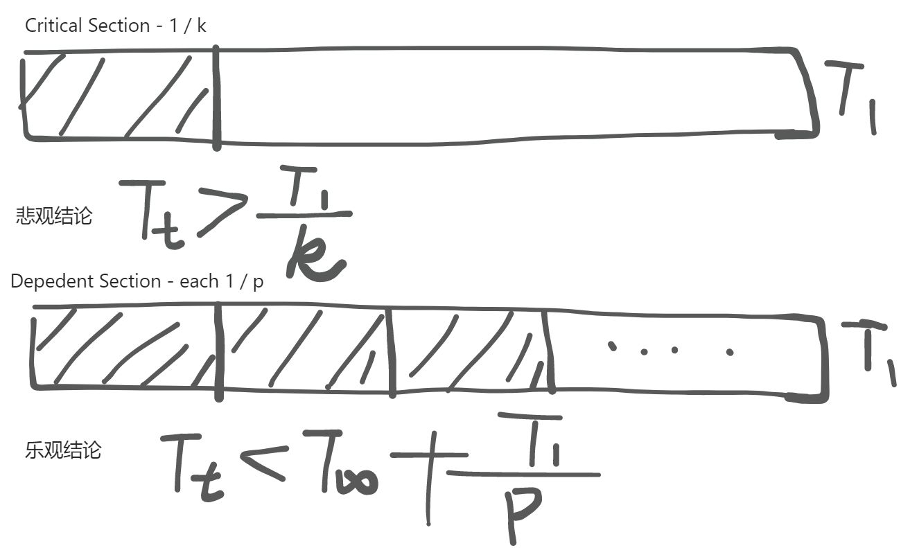
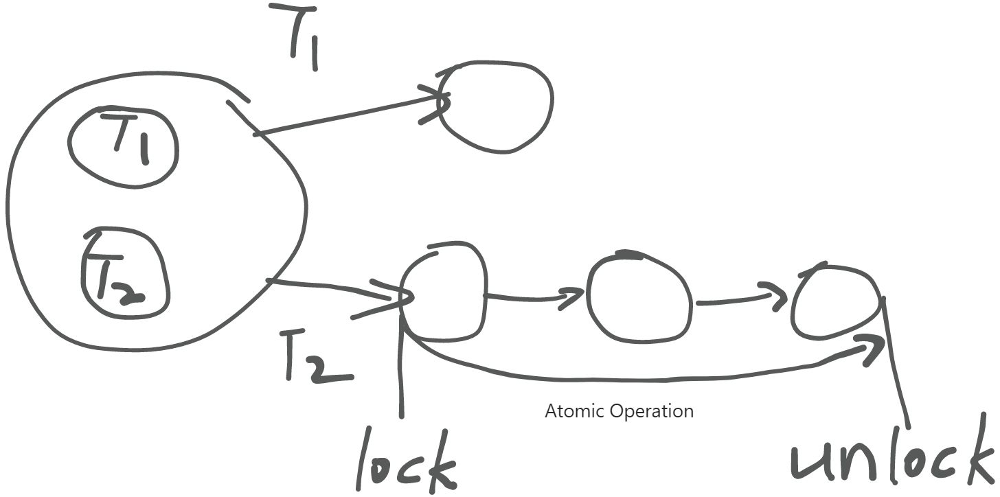
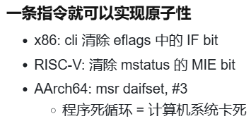
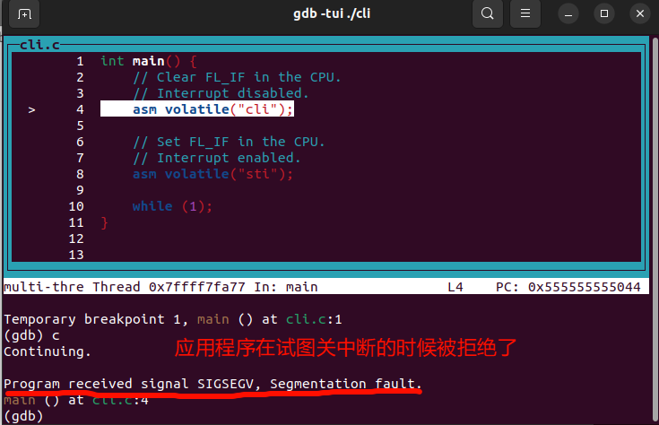
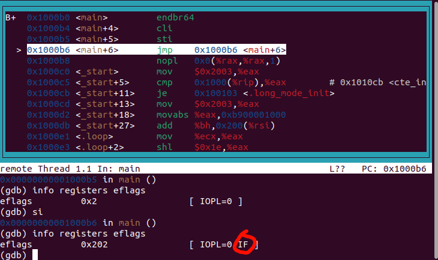
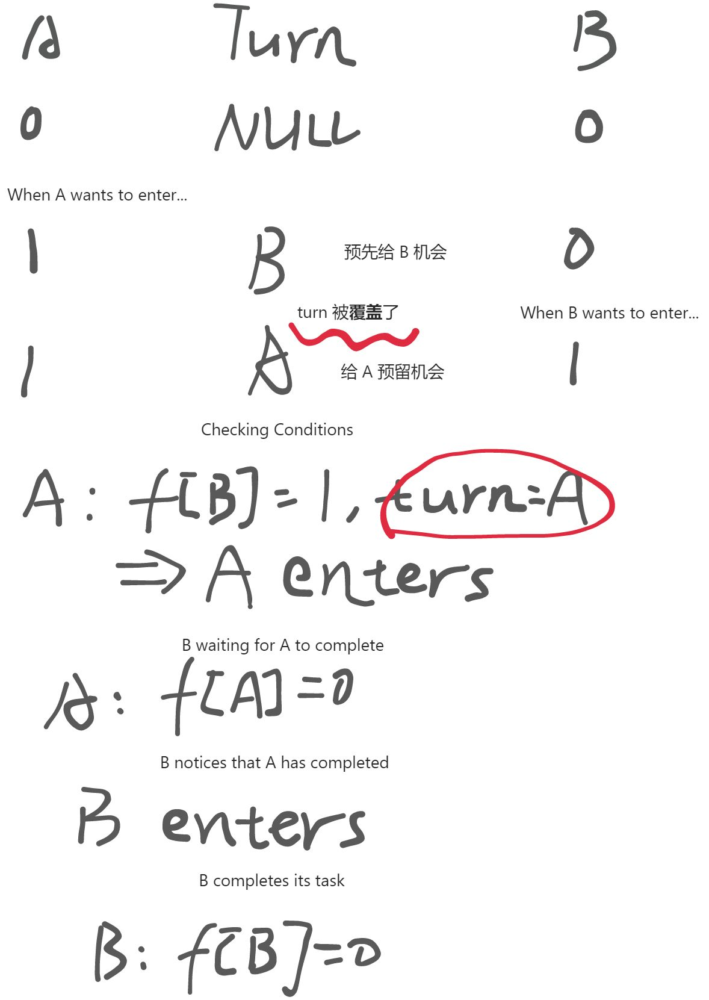
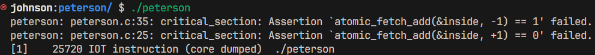

# 并发 - 2：并发控制 - 互斥 (1)

## 并发控制 - 阻止并发
并发给并发程序带来了一系列不容易被我们直接察觉的 bug (例如某山寨支付宝的错误扣款例子)。我们有没有什么办法可以对并发进行控制呢？

也许 **阻止并发** 是唯一的方法。但是，如果 **阻止并发** 是对并发进行正确控制的唯一方法，那么并发为什么要存在？



看起来，并行总归是有作用的：只要在不需要并发的时候阻止并发，其余情况下启用并发，并发总能给程序执行提速。

## 实现互斥 - Stop the World


为了尽可能避免并行带来的一系列 bug ，我们试图通过添加**锁**来保证指定状态迁移步骤的原子性。简单来说，就是当某个线程持有锁的时候，其他状态迁移不能够入侵该线程的状态迁移过程，以此实现持有锁过程中状态迁移的原子性。

那么如何实现互斥呢？

+ 单处理器系统：**关闭中断 (剥夺切换状态机的能力)**
+ 多处理器系统：???



然而，道高一尺，魔高一丈。处理器中存在着 **NMI** <font style="color:rgb(31, 35, 40);">(</font>_<font style="color:rgb(31, 35, 40);">Non-Maskable Interrupts</font>_<font style="color:rgb(31, 35, 40);">，不可屏蔽中断)，例如掉电中断等情况。</font>

<font style="color:rgb(31, 35, 40);">关中断并不是万能的：</font>

**<font style="color:rgb(20, 20, 20);">操作系统可以，但普通程序不行</font>**

+ <font style="color:rgb(31, 35, 40);">中断保证了死循环不能把计算机 “卡死”</font>
+ <font style="color:rgb(31, 35, 40);">操作系统不允许普通程序关中断  
</font>
    - <font style="color:rgb(31, 35, 40);">但如果是操作系统代码，完全可以短暂关闭中断  
</font>

**<font style="color:rgb(20, 20, 20);">单处理器系统可以，多处理器系统不行</font>**

+ <font style="color:rgb(31, 35, 40);">每个处理器有独立的寄存器组</font>
+ <font style="color:rgb(31, 35, 40);">中断是</font>**<font style="color:rgb(31, 35, 40);">每个处理器内部状态</font>**

> <font style="color:rgb(15, 23, 42);">对于操作系统上的应用程序，关闭中断是</font>**<font style="color:rgb(15, 23, 42);">不能容忍</font>**<font style="color:rgb(15, 23, 42);">的：这会使微小的 bug 或是恶意的程序破坏计算机的运行。操作系统正是因为统治了中断，才实现了对应用程序的管理。在操作系统内核的实现中，关闭中断是一个常见的操作。</font>
>

## 实现互斥 - Peterson 算法
### Dekker 算法
> <font style="color:rgb(101, 109, 118);">A process </font>$ P $<font style="color:rgb(101, 109, 118);"> can enter the critical section if </font>**<font style="color:rgb(101, 109, 118);">the other does not want to enter</font>**<font style="color:rgb(101, 109, 118);">, otherwise it may enter </font>**<font style="color:rgb(101, 109, 118);">only if it is its turn</font>**<font style="color:rgb(101, 109, 118);">.</font>
>

### Peterson 算法 - Dekker 算法的改进
> <font style="color:rgb(101, 109, 118);">A process </font>$ P $<font style="color:rgb(101, 109, 118);"> can enter the critical section if </font>**<font style="color:rgb(101, 109, 118);">the other does not want to enter</font>**<font style="color:rgb(101, 109, 118);">, or it has </font>**<font style="color:rgb(101, 109, 118);">indicated its desire to enter (意图)</font>**<font style="color:rgb(101, 109, 118);"> and has </font>**<font style="color:rgb(101, 109, 118);">given the other process the turn (让步)</font>**<font style="color:rgb(101, 109, 118);">.</font>
>

<font style="color:rgb(101, 109, 118);">一个简单的例子：</font>



来简单归纳一下游戏规则吧：

+ 当一个线程想要进入 Critical Section 时，需要将自己对应的**旗子举起**，并且预先将执行权限分配给**<u>其余</u>****线程中的某一个**(即改变 turn 的值为另一个线程)。
+ 在这个线程执行完上述设置操作后，该线程将会进入持续的观察者模式：
    - 观察其余线程中是否存在举旗的线程，如果**没有**则直接进入 Critical Section
    - 如果存在举旗线程，则观察 turn 变量的值 (可以理解为下一个待执行的线程)，**如果为自己**则进入 Critical Section，否则继续等待
+ 线程执行完成 Critical Section 区域的代码后，需要**放下**自己的旗子

当有多个线程同时尝试进入 Critical Section 时，线程的手快程度直接影响了其余线程被优先执行的概率 —— 你写入的 turn 很有可能会被后续写入的线程覆盖，但是你写入的 turn 值是**其余线程**。看起来 Peterson's Protocal 是一个谦让协议，但是实际上它是个**利己**协议。

### Peterson's Algorithm - 实现
```python
def T1():
    while True:
        heap.x = '🏴'
        sys_sched()
        heap.turn = '❷'
        sys_sched()
        while True:
            t = heap.turn
            sys_sched()
            y = heap.y != ''
            sys_sched()
            if not y or t == '❶':
                break
        sys_sched()
        heap.cs += '❶'
        sys_sched()
        heap.cs = heap.cs.replace('❶', '')
        sys_sched()
        heap.x = ''
        sys_sched()
 
def T2():
    while True:
        heap.y = '🏁'
        sys_sched()
        heap.turn = '❶'
        sys_sched()
        while True:
            t = heap.turn
            sys_sched()
            x = heap.x
            sys_sched()
            if not x or t == '❷':
                break
            sys_sched()
        sys_sched()
        heap.cs += '❷'
        sys_sched()
        heap.cs = heap.cs.replace('❷', '')
        sys_sched()
        heap.y = ''
        sys_sched()

def main():
    heap.x = ''
    heap.y = ''
    heap.turn = ''
    heap.cs = ''
    sys_spawn(T1)
    sys_spawn(T2)

```

上面的代码在我们的 Model Checker 上执行的结果是正确的。

但是，如果在现代“编译器化”的处理器上执行，会输出正确的结果吗？

答案是否定的。

我们重新用 C 语言编写了一个 Peterson's Algorithm 的实现：

```c
#include "thread.h"
#include <stdatomic.h>

#define A 1
#define B 2

// The caveat is: no matter how many times we run this test
// without seeing it fail, we cannot be certain that we have
// inserted sufficient barriers. Understanding the correctness
// of this code is far beyond the scope of this course.
// 
// #define BARRIER __sync_synchronize()
//
// Peterson's algorithm is wrong without proper barriers:
//
#define BARRIER

atomic_int inside;
long count;

void critical_section() {
    // We expect this thread executing code exclusively,
    // if the critical section is correctly implemented.
 
    assert(
        // assert(inside == 0);
        // inside++
        atomic_fetch_add(&inside, +1) == 0
    );

    // On some machines, printing a character will hide
    // the bug!
    // putchar('.');

    assert(
        // assert(inside == 1);
        // inside--
        atomic_fetch_add(&inside, -1) == 1
    );
}

int volatile a = 0, b = 0, turn;

void T_A() {
    while (1) {
        a = 1;                    BARRIER;
        turn = B;                 BARRIER; // <- this is critcal for x86
        while (1) {
            if (!b) break;        BARRIER;
            if (turn != B) break; BARRIER;
        }

        // T_B can't execute critical_section now.
        critical_section();

        a = 0;                    BARRIER;
    }
}

void T_B() {
    while (1) {
        b = 1;                    BARRIER;
        turn = A;                 BARRIER;
        while (1) {
            if (!a) break;        BARRIER;
            if (turn != A) break; BARRIER;
        }

        // T_A can't execute critical_section now.
        critical_section();

        b = 0;                    BARRIER;
    }
}

int main() {
    create(T_A);
    create(T_B);
}

```

运行结果：



我们给它重新加回 Barrier 之后，会怎么样呢？


虽然加了 Barrier 能够使程序的行为变得“看起来”正确，但是你能确定**<font style="color:rgb(68, 136, 204);">哪些地方的 barrier 是不可少的吗</font>**<font style="color:rgb(31, 35, 40);">？</font>

<font style="color:rgb(31, 35, 40);">因为 Peterson 算法在现代处理器上需要添加许多屏障(或许有许多地方可以优化，但是你基本上无法确定哪些地方的屏障是必不可少的)，所以该算法在现在已经不怎么使用了。</font>

## <font style="color:rgb(31, 35, 40);">多处理器系统上的互斥</font>
实际上，互斥的根本目的是为了保证 Critical Section 操作的**原子性**。

为了在软件方面实现原子迁移，人类提出了 Dekker 算法、Peterson 算法...甚至还需要加装许多你无法完全确定如何优化的屏障来保证正确性...

但是，在计算机上，软硬件是互补的，因此“**软件不够，硬件来凑**”。

如果要在硬件方面实现互斥以保证 Critical Section 操作的原子性，我们也许可以小小的借用一下 Stop the World 的能力 —— 使用原子指令。

原子指令提供了一小段时间的“Stop the World”执行能力，为状态迁移的原子性做了保证。

+ <font style="color:rgb(31, 35, 40);">不可打断的 load + 计算 + store</font>
    - <font style="color:rgb(31, 35, 40);">x86: Bus Lock; RISC-V: LR/SC (来自 MIPS) + atomic</font>

<font style="color:rgb(31, 35, 40);">有了原子指令，总算可以在多处理器上实现 并行 1 + 1 了！</font>

### <font style="color:rgb(31, 35, 40);">原子指令实现自旋锁</font>
> 自旋锁： 
>

```c
int status = ✅;

// 这个进程状态机中只存在一个✅

void lock() {
retry:
    int got = atomic_xchg(&status, ❌); // 原子交换指令
    // 手慢的进程会一直在这里“自旋”
    if (got != ✅) {
        goto retry;
    }
}

void unlock() {
    atomic_xchg(&status, ✅);
}
```

### 一核自旋中断，多核自旋？
解决方案：操作系统短暂关中断


> 更新: 2024-11-01 14:39:34  
> 原文: <https://www.yuque.com/yuqueyonghukaqxkk/self_learning_route/cf1ggoir94b637dw>