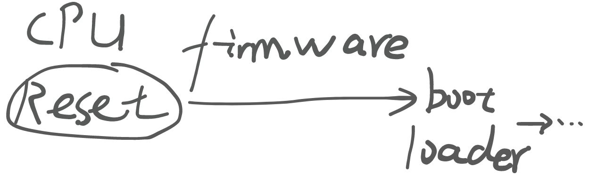
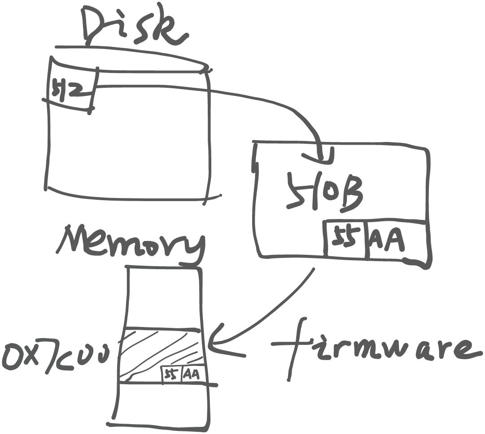
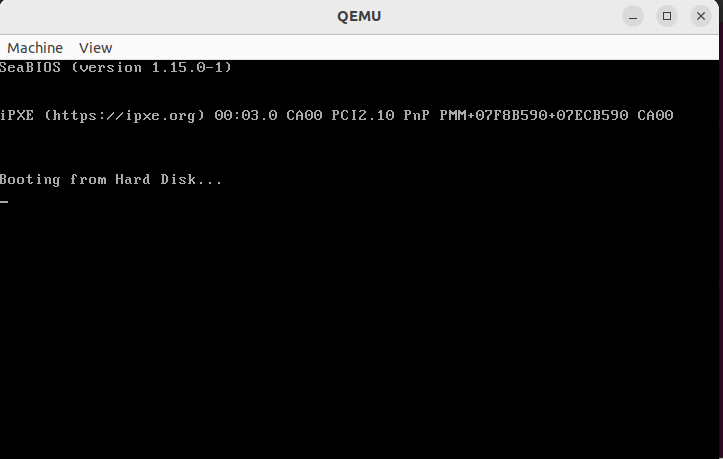
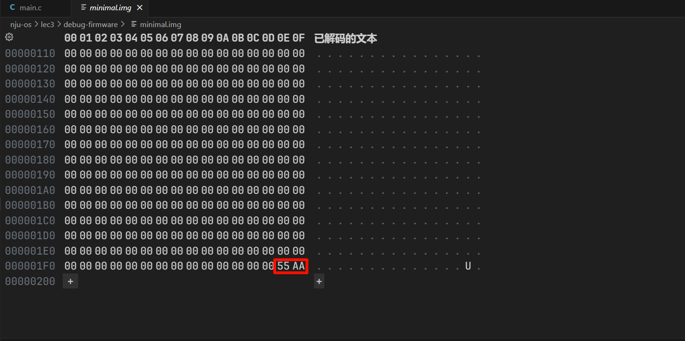
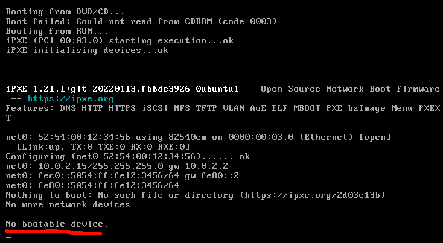

# 绪论3 硬件视角的操作系统

##  计算机系统的状态机模型
根据绪论 2 中所抛出的 `Everything is state machine.` 这一思想，我们尝试着把计算机系统也抽象成一个状态机。

+ <font style="color:rgb(20, 20, 20);">状态</font>
    - <font style="color:rgb(31, 35, 40);">内存、寄存器的数值</font>
    - <font style="color:rgb(31, 35, 40);">这就完了？</font>
+ <font style="color:rgb(20, 20, 20);">初始状态</font>
    - <font style="color:rgb(31, 35, 40);">由系统设计者规定 (CPU Reset)</font>
+ <font style="color:rgb(20, 20, 20);">状态迁移</font>
    - <font style="color:rgb(31, 35, 40);">从 PC 取指令执行</font>
    - <font style="color:rgb(31, 35, 40);">只有这一种简单操作吗？</font>

<font style="color:rgb(31, 35, 40);">计算机系统具有物理态，它的状态与外部世界是有关系的，例如 I/O、中断、Reset 等</font>**<font style="color:rgb(31, 35, 40);">外部输入的</font>**<font style="color:rgb(31, 35, 40);">状态(不考虑</font>**<font style="color:rgb(31, 35, 40);">内部</font>**<font style="color:rgb(31, 35, 40);">必要的中断等)，这些都是客观存在的，但是计算机系统无法直接访问(与进程无法直接访问进程外的信息类似)。</font>

+ <font style="color:rgb(20, 20, 20);">执行指令</font>
    - <font style="color:rgb(31, 35, 40);">如果有多个处理器？</font>
        * <font style="color:rgb(31, 35, 40);">可以想象成 “每次选一个处理器执行一条指令”</font>
        * <font style="color:rgb(31, 35, 40);">在并发部分会回到这个问题</font>
+ <font style="color:rgb(20, 20, 20);">中断响应</font>
    - `<font style="color:rgb(31, 35, 40);">if (intr) goto vec;</font>`
+ <font style="color:rgb(20, 20, 20);">输入输出</font>
    - <font style="color:rgb(31, 35, 40);">与 “计算机系统外” 交换数据</font>
    - <font style="color:rgb(31, 35, 40);">类似于程序：不使用 </font>`<font style="color:rgb(31, 35, 40);">syscall</font>`<font style="color:rgb(31, 35, 40);"> 就等于死循环 -> 不获取外部状态就等于死循环</font>

## 固件(Firmware)


## 调试固件
<font style="color:rgb(20, 20, 20);">在 IBM PC/PC-DOS 2.0 (1983) 时代，计算机就与程序员有了如下约定：</font>

+ <font style="color:rgb(31, 35, 40);">Firmware (BIOS) 会加载磁盘的前 512 字节到内存中的 </font>`<font style="color:rgb(31, 35, 40);">0x7c00</font>`<font style="color:rgb(31, 35, 40);"> 位置</font>
    - <font style="color:rgb(31, 35, 40);">前提：这 512 字节最后是 </font>`<font style="color:rgb(31, 35, 40);">0x55</font>`<font style="color:rgb(31, 35, 40);">, </font>`<font style="color:rgb(31, 35, 40);">0xAA</font>`



<font style="color:rgb(31, 35, 40);">(看向了手头的 QEMU)：要不试试看吧</font>

```bash
( echo "eb fe 11 22 33 44" | xxd -r -p; \
	  cat /dev/zero | head -c 504; \
	  echo "55 aa" | xxd -r -p \
) > minimal.img

# run the provided Makefile
make 
```





然后我们尝试着把最后 2 Byte 的内容修改一下：




**如果 Firmware 也是一段代码？**

<font style="color:rgb(20, 20, 20);">计算机系统从 </font>`<font style="color:rgb(20, 20, 20);">CPU Reset</font>`<font style="color:rgb(20, 20, 20);"> 开始：</font>

+ `<font style="color:rgb(31, 35, 40);">CPU Reset</font>`<font style="color:rgb(31, 35, 40);"> 的时候，</font>`<font style="color:rgb(31, 35, 40);">0x7c00</font>`<font style="color:rgb(31, 35, 40);"> 应该是啥也没有的</font>
+ <font style="color:rgb(31, 35, 40);">Firmware 的代码扫描了磁盘、加载了它</font>

<font style="color:rgb(31, 35, 40);">那么照理来说，我们或许可以看到 Firmware 加载磁盘字节的过程，换句话说，我们应该能够看到 Firmware 中的哪条指令对 </font>`<font style="color:rgb(31, 35, 40);">0x7c00</font>`<font style="color:rgb(31, 35, 40);"> 位置上的数据进行了修改。</font>

<font style="color:rgb(31, 35, 40);">那你自然而然就能想到我们的老朋友 Debugger —— </font>`<font style="color:rgb(31, 35, 40);">gdb</font>`<font style="color:rgb(31, 35, 40);">。通过在 </font>`<font style="color:rgb(31, 35, 40);">0x7c00</font>`<font style="color:rgb(31, 35, 40);"> 这一观察点上设置</font>[监视点(Watchpoint)](https://sourceware.org/gdb/current/onlinedocs/gdb.html/Set-Watchpoints.html)<font style="color:rgb(31, 35, 40);"> 与 Breakpoint，我们就能够调试并且观察到哪条指令对 </font>`<font style="color:rgb(31, 35, 40);">0x7c00</font>`<font style="color:rgb(31, 35, 40);"> 位置上的内容进行了修改。</font>

> 监视点：当被设置监视点的位置上的值被修改时，程序会暂停运行。结合 PC 指针即可获取到此前正在执行的指令。
>

然而，每次调试都需要在 `0x7c00` 处添加监视点和断点，如果你手滑退出去了，又需要重新设置断点后调试，这也太烦人了。

所以，我们可以针对不同的调试需求预先定义 `gdb` 调试的相关设置，详见 `debug-firmware` 中的 `init.gdb` 文件内容与 `debug-bootloader` 中的 `debug.py` 脚本。

<details class="lake-collapse"><summary id="u936f37d3"><span class="ne-text">Extra：About -s and -S in qemu commands</span></summary><p id="u7b57c015" class="ne-p"><span class="ne-text">In the command </span><code class="ne-code"><span class="ne-text">qemu-system-x86_64 -s -S $&lt; &amp;</span></code><span class="ne-text">, the options </span><code class="ne-code"><span class="ne-text">-s</span></code><span class="ne-text"> and </span><code class="ne-code"><span class="ne-text">-S</span></code><span class="ne-text"> serve the following purposes:</span></p><ol class="ne-ol"><li id="u9e6783ff" data-lake-index-type="0"><code class="ne-code"><span class="ne-text">-s</span></code><strong><span class="ne-text"> (Shorthand for setting up GDB server):</span></strong></li></ol><ul class="ne-list-wrap"><ul ne-level="1" class="ne-ul"><li id="u8a654ce6" data-lake-index-type="0"><span class="ne-text">This option tells QEMU to start a </span><strong><span class="ne-text">GDB server</span></strong><span class="ne-text">(That's why we need to connect to the remote in </span><code class="ne-code"><span class="ne-text">init.gdb</span></code><span class="ne-text">) on port 1234. This allows you to connect a GDB debugger to the QEMU instance for debugging purposes.</span></li><li id="uc3eb6bc1" data-lake-index-type="0"><span class="ne-text">It is often used for debugging, enabling you to inspect the virtual machine's execution through a debugger like GDB.</span></li></ul></ul><ol start="2" class="ne-ol"><li id="ud2030f0e" data-lake-index-type="0"><code class="ne-code"><span class="ne-text">-S</span></code><strong><span class="ne-text"> (Start execution in a stopped state):</span></strong></li></ol><ul class="ne-list-wrap"><ul ne-level="1" class="ne-ul"><li id="u812aae92" data-lake-index-type="0"><span class="ne-text">This option tells QEMU to start the virtual machine but keep the CPU in a paused (stopped) state. The execution won't start until you explicitly resume it, for example, using GDB commands.</span></li><li id="u583d03d8" data-lake-index-type="0"><span class="ne-text">This is useful when you want to set breakpoints or examine the state of the system before running any code.</span></li></ul></ul><p id="u59af5bbc" class="ne-p"><span class="ne-text">Together, these options allow for powerful debugging capabilities where QEMU starts but waits for GDB to connect and control the execution flow of the virtual machine.</span></p></details>
## Makefile 的正确打开方式
> Every Makefile is a state machine -> It just runs instructions.
>

因此，我们可以像先前观察 C 程序一样去观察状态机本身以及状态机的执行情况。

```bash
make -nB

# An example
make -nB \
  | grep -ve '^\(\#\|echo\|mkdir\|make\)' \ # filter
  | sed "s#$AM_HOME#\$AM_HOME#g" \ # easy to read
  | sed "s#$PWD#.#g" \
  | vim -
```

## <font style="color:rgb(15, 23, 42);">Take-away Messages</font>
<font style="color:rgb(15, 23, 42);">计算机系统是严格的数学对象：没有魔法;计算机系统的一切行为都是可观测、可理解的。</font>

+ <font style="color:rgb(15, 23, 42);">处理器是无情的执行指令的机器。</font>
+ <font style="color:rgb(15, 23, 42);">处理器会规定好 </font>`<font style="color:rgb(15, 23, 42);">Reset</font>`<font style="color:rgb(15, 23, 42);"> 后的行为。</font>
+ `<font style="color:rgb(15, 23, 42);">Reset</font>`<font style="color:rgb(15, 23, 42);"> 后 Firmware 开始运行，再加载操作系统(bootloader)。</font>
+ <font style="color:rgb(15, 23, 42);">厂商逐渐形成了达成共识的 Firmware Specification (IBM PC “兼容机”、UEFI、……)。</font>


> 更新: 2024-10-23 08:50:19  
> 原文: <https://www.yuque.com/yuqueyonghukaqxkk/self_learning_route/oatcgglaez4zvwn0>